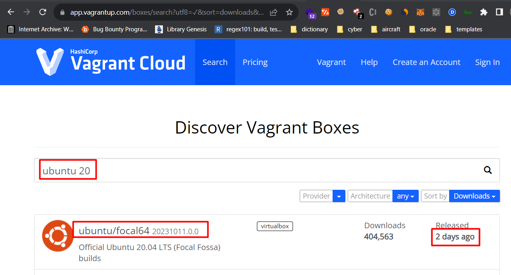
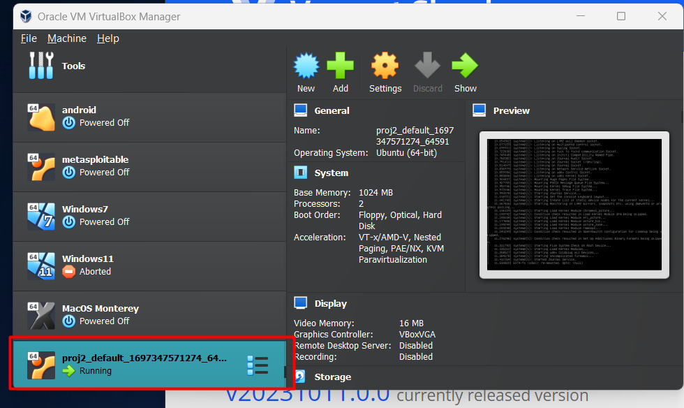
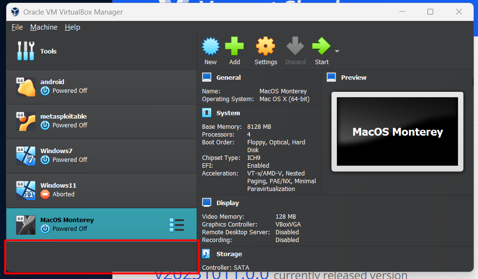

# Vagrant summary
first of all we should create a directory,

```cmd
PS C:\Users\xxxxx\Documents\Projects\Vagrant> mkdir proj1
```
go into the directory and initalize the Vagrant project

```cmd
PS C:\Users\xxxxx\Documents\Projects\Vagrant> cd .\proj1\
PS C:\Users\xxxxx\Documents\Projects\Vagrant\proj1> vagrant init
A `Vagrantfile` has been placed in this directory. You are now
ready to `vagrant up` your first virtual environment! Please read
the comments in the Vagrantfile as well as documentation on
`vagrantup.com` for more information on using Vagrant.
```

Command ```vagrant init``` will create ```Vagrantfile``` configuration file.
When we open ```Vagrantfile```, we can see that many parameters are not set.
to install ubuntu image we should find the image name from ```https://vagrantcloud.com/search```

when you search for ubuntu result will come with older versions, but I planned to install more leatest version, that's why I searched for "Ubuntu 20":



now we have to insert image name to ```Vagrantfile``` just by replacing ```base``` to ```ubuntu/focal64``` of ```config.vm.box``` parameter:

```ruby
  # Every Vagrant development environment requires a box. You can search for
  # boxes at https://vagrantcloud.com/search.
  config.vm.box = "ubuntu/focal64"
```

I have configured VM with ```1024 MB``` of ram and give access to ```2 CPU```:
```ruby
config.vm.provider "virtualbox" do |vb|
    # Display the VirtualBox GUI when booting the machine
    vb.gui = true
  
    # Customize the amount of memory on the VM:
    vb.memory = "1024"
    vb.cpus = 2
  end
```
now we are ready to run our virtual machine with command ```vagrant up```:

```cmd
PS C:\Users\xxxxx\Documents\Projects\Vagrant\proj1> vagrant up
Bringing machine 'default' up with 'virtualbox' provider...
==> default: Box 'ubuntu/focal64' could not be found. Attempting to find and install...
    default: Box Provider: virtualbox
    default: Box Version: >= 0
==> default: Loading metadata for box 'ubuntu/focal64'
    default: URL: https://vagrantcloud.com/ubuntu/focal64
==> default: Adding box 'ubuntu/focal64' (v20231011.0.0) for provider: virtualbox
    default: Downloading: https://vagrantcloud.com/ubuntu/boxes/focal64/versions/20231011.0.0/providers/virtualbox/unknown/vagrant.box
Download redirected to host: cloud-images.ubuntu.com
    default:
==> default: Successfully added box 'ubuntu/focal64' (v20231011.0.0) for 'virtualbox'!
==> default: Importing base box 'ubuntu/focal64'...
==> default: Matching MAC address for NAT networking...
==> default: Checking if box 'ubuntu/focal64' version '20231011.0.0' is up to date...
==> default: Setting the name of the VM: proj1_default_1697297750363_4213
==> default: Clearing any previously set forwarded ports...
Vagrant is currently configured to create VirtualBox synced folders with
the `SharedFoldersEnableSymlinksCreate` option enabled. If the Vagrant
guest is not trusted, you may want to disable this option. For more
information on this option, please refer to the VirtualBox manual:

  https://www.virtualbox.org/manual/ch04.html#sharedfolders

This option can be disabled globally with an environment variable:

  VAGRANT_DISABLE_VBOXSYMLINKCREATE=1

or on a per folder basis within the Vagrantfile:

  config.vm.synced_folder '/host/path', '/guest/path', SharedFoldersEnableSymlinksCreate: false
==> default: Clearing any previously set network interfaces...
==> default: Preparing network interfaces based on configuration...
    default: Adapter 1: nat
==> default: Forwarding ports...
    default: 22 (guest) => 2222 (host) (adapter 1)
==> default: Running 'pre-boot' VM customizations...
==> default: Booting VM...
==> default: Waiting for machine to boot. This may take a few minutes...
    default: SSH address: 127.0.0.1:2222
    default: SSH username: vagrant
    default: SSH auth method: private key
    default:
    default: Vagrant insecure key detected. Vagrant will automatically replace
    default: this with a newly generated keypair for better security.
    default:
    default: Inserting generated public key within guest...
    default: Removing insecure key from the guest if it's present...
    default: Key inserted! Disconnecting and reconnecting using new SSH key...
==> default: Machine booted and ready!
==> default: Checking for guest additions in VM...
    default: The guest additions on this VM do not match the installed version of
    default: VirtualBox! In most cases this is fine, but in rare cases it can
    default: prevent things such as shared folders from working properly. If you see
    default: shared folder errors, please make sure the guest additions within the
    default: virtual machine match the version of VirtualBox you have installed on
    default: your host and reload your VM.
    default:
    default: Guest Additions Version: 4.3.40
    default: VirtualBox Version: 7.0
==> default: Mounting shared folders...
    default: /vagrant => C:/Users/xxxxx/OneDrive/Documents/Projects/Vagrant/proj1
```
and our VM is ready to ```VirtualBoxe's``` interface too.



Our instance is created.
To connect vagrant image remotely we can use ```ssh``` connection.
to connect to the virtual machine run ```vagrant ssh``` command:

```cmd
PS C:\Users\xxxxx\Documents\Projects\Vagrant\proj1> vagrant ssh
Welcome to Ubuntu 20.04.1 LTS (GNU/Linux 3.13.0-170-generic x86_64)

 * Documentation:  https://help.ubuntu.com/

  System information as of Sat Oct 14 15:36:18 UTC 2023

  System load:  1.02              Processes:           93
  Usage of /:   3.6% of 39.34GB   Users logged in:     0
  Memory usage: 13%               IP address for eth0: 10.0.2.15
  Swap usage:   0%

  Graph this data and manage this system at:
    https://landscape.canonical.com/

UA Infrastructure Extended Security Maintenance (ESM) is not enabled.

0 updates can be installed immediately.
0 of these updates are security updates.

Enable UA Infrastructure ESM to receive 64 additional security updates.
See https://ubuntu.com/advantage or run: sudo ua status

New release '16.04.7 LTS' available.
Run 'do-release-upgrade' to upgrade to it.
```
we should exit VM to shutdown the machine:
```cmd
vagrant@vagrant-ubuntu-focal-64:~$ exit
logout
Connection to 127.0.0.1 closed.
```
now we can stop machine with command ```vagrant halt```:
```cmd
PS C:\Users\xxxxx\Documents\Projects\Vagrant\proj1> vagrant halt
==> default: Attempting graceful shutdown of VM...
```
now let's try to connect to machine using ssh one more time
```cmd
PS C:\Users\xxxxx\Documents\Projects\Vagrant\proj1> vagrant ssh
VM must be running to open SSH connection. Run `vagrant up`
to start the virtual machine.
```
as you can see machine is turned off.
now we can remove machine using ```vagrant destroy``` command:
```
PS C:\Users\xxxxx\Documents\Projects\Vagrant\proj1> vagrant destroy
    default: Are you sure you want to destroy the 'default' VM? [y/N] y
==> default: Destroying VM and associated drives...
```
and it is gone now:

