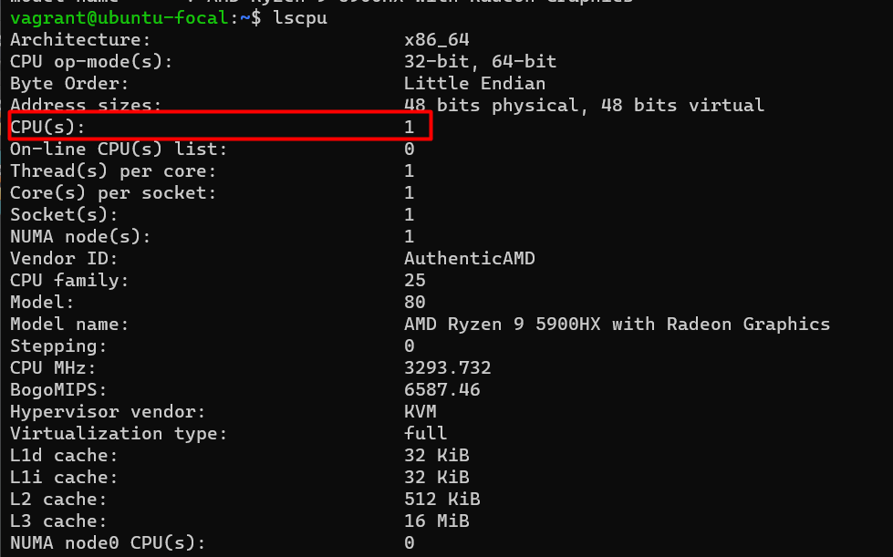
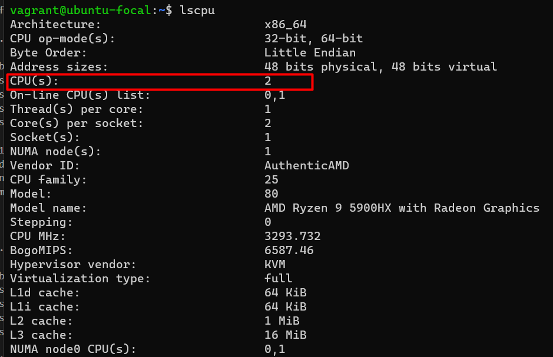

# Vagrant network configuration
My vagrantfile looks like this:

```ruby
Vagrant.configure("2") do |config|
  config.vm.box = "ubuntu/focal64"
  config.vm.provision "shell", path: "install-nginx.sh"

  config.vm.define "vm1" do |vm1|
    vm1.vm.network "private_network", ip: "192.168.1.101"
    vm1.vm.provider "virtualbox" do |vb|
      vb.memory=1024
      vb.cpus=1
    end
  end

  config.vm.define "vm2" do |vm2|
    vm2.vm.network "private_network", ip: "192.168.1.102"
    vm2.vm.provider "virtualbox" do |vb|
      vb.memory=1024
      vb.cpus=2
    end
  end
```
#### Script
script ```install-nginx.sh``` is outside of two machine scopes, the reason is we this script is common for all machine.
```bash
#!/usr/bin/env bash

sudo apt-get -y update
sudo apt-get -y install nginx
echo 'Hello World' | sudo tee /var/www/html/index.html
sudo service nginx start
```
this cript installes ```nginx``` and saves ```Hello World``` to nginx's default index file.
now our machine is ready to start, you can find building logs in ```vagrant_up.log``` file


#### configurations
As we know cpus were different for both machine.
for first machine ```1 CPU``` was configured


and for second machine ```2 CPU``` was configured

and rams were similar for moth machine:


#### Network
Machines are using NAT interface taht's why I have set new ip address for every machine,
that we can ping ever machine from main pc.
```cmd 
PS C:\Users\xxxx> ping 192.168.1.101

Pinging 192.168.1.101 with 32 bytes of data:
Reply from 192.168.1.101: bytes=32 time<1ms TTL=64
Reply from 192.168.1.101: bytes=32 time<1ms TTL=64
Reply from 192.168.1.101: bytes=32 time<1ms TTL=64
Reply from 192.168.1.101: bytes=32 time<1ms TTL=64

Ping statistics for 192.168.1.101:
    Packets: Sent = 4, Received = 4, Lost = 0 (0% loss),
Approximate round trip times in milli-seconds:
    Minimum = 0ms, Maximum = 0ms, Average = 0ms
PS C:\Users\xxxx> ^C
```
```cmd
PS C:\Users\xxxx> ping 192.168.1.102

Pinging 192.168.1.102 with 32 bytes of data:
Reply from 192.168.1.102: bytes=32 time<1ms TTL=64
Reply from 192.168.1.102: bytes=32 time<1ms TTL=64
Reply from 192.168.1.102: bytes=32 time<1ms TTL=64
Reply from 192.168.1.102: bytes=32 time<1ms TTL=64

Ping statistics for 192.168.1.102:
    Packets: Sent = 4, Received = 4, Lost = 0 (0% loss),
Approximate round trip times in milli-seconds:
    Minimum = 0ms, Maximum = 0ms, Average = 0ms
PS C:\Users\xxxx> ^C
```
We should run ```vagrant global-status``` to get information about installed instances:
```cmd 
PS C:\Users\xxxx> vagrant global-status
id       name   provider   state   directory
--------------------------------------------------------------------------------------------
4fb13d4  vm1    virtualbox running C:/Users/xxxx/Documents/Projects/Vagrant/proj2
4bd0acc  vm2    virtualbox running C:/Users/xxxx/Documents/Projects/Vagrant/proj2

The above shows information about all known Vagrant environments
on this machine. This data is cached and may not be completely
up-to-date (use "vagrant global-status --prune" to prune invalid
entries). To interact with any of the machines, you can go to that
directory and run Vagrant, or you can use the ID directly with
Vagrant commands from any directory. For example:
"vagrant destroy 1a2b3c4d"
```
now we can connect to ```ssh``` using id of machine
```cmd
PS C:\Users\xxxx> vagrant ssh 4fb13d4
Welcome to Ubuntu 20.04.6 LTS (GNU/Linux 5.4.0-164-generic x86_64)

 * Documentation:  https://help.ubuntu.com
 * Management:     https://landscape.canonical.com
 * Support:        https://ubuntu.com/advantage

  System information as of Sun Oct 15 06:29:41 UTC 2023

  System load:  0.0               Processes:               107
  Usage of /:   4.1% of 38.70GB   Users logged in:         0
  Memory usage: 20%               IPv4 address for enp0s3: 10.0.2.15
  Swap usage:   0%                IPv4 address for enp0s8: 192.168.1.101


Expanded Security Maintenance for Applications is not enabled.

0 updates can be applied immediately.

Enable ESM Apps to receive additional future security updates.
See https://ubuntu.com/esm or run: sudo pro status

New release '22.04.3 LTS' available.
Run 'do-release-upgrade' to upgrade to it.
```
we are in VM ```192.168.1.101```, first we have to check ```nginx``` installed or not
```cmd
vagrant@ubuntu-focal:~$ which nginx
/usr/sbin/nginx
```
nginx is installed successfully
we have to check ping to ```192.168.1.102``` now: 
```cmd
vagrant@ubuntu-focal:~$ ping 192.168.1.102
PING 192.168.1.102 (192.168.1.102) 56(84) bytes of data.
64 bytes from 192.168.1.102: icmp_seq=1 ttl=64 time=1.12 ms
64 bytes from 192.168.1.102: icmp_seq=2 ttl=64 time=0.729 ms
64 bytes from 192.168.1.102: icmp_seq=3 ttl=64 time=0.786 ms
64 bytes from 192.168.1.102: icmp_seq=4 ttl=64 time=0.752 ms
64 bytes from 192.168.1.102: icmp_seq=5 ttl=64 time=0.719 ms
^C
--- 192.168.1.102 ping statistics ---
5 packets transmitted, 5 received, 0% packet loss, time 4010ms
rtt min/avg/max/mdev = 0.719/0.820/1.118/0.150 ms
vagrant@ubuntu-focal:~$ exit
logout
Connection to 127.0.0.1 closed.
```
I am connecting to second machine now:
```cmd
PS C:\Users\xxxx> vagrant ssh 4bd0acc
Welcome to Ubuntu 20.04.6 LTS (GNU/Linux 5.4.0-164-generic x86_64)

 * Documentation:  https://help.ubuntu.com
 * Management:     https://landscape.canonical.com
 * Support:        https://ubuntu.com/advantage

  System information as of Sun Oct 15 06:30:50 UTC 2023

  System load:  0.0               Processes:               119
  Usage of /:   4.1% of 38.70GB   Users logged in:         0
  Memory usage: 21%               IPv4 address for enp0s3: 10.0.2.15
  Swap usage:   0%                IPv4 address for enp0s8: 192.168.1.102


Expanded Security Maintenance for Applications is not enabled.

0 updates can be applied immediately.

Enable ESM Apps to receive additional future security updates.
See https://ubuntu.com/esm or run: sudo pro status

New release '22.04.3 LTS' available.
Run 'do-release-upgrade' to upgrade to it.
```
cheching ```nginx```
```cmd
vagrant@ubuntu-focal:~$ which nginx
/usr/sbin/nginx
```
web server is installed correctly
```cmd
vagrant@ubuntu-focal:~$ ping 192.168.1.101
PING 192.168.1.101 (192.168.1.101) 56(84) bytes of data.
64 bytes from 192.168.1.101: icmp_seq=1 ttl=64 time=0.373 ms
64 bytes from 192.168.1.101: icmp_seq=2 ttl=64 time=0.672 ms
64 bytes from 192.168.1.101: icmp_seq=3 ttl=64 time=0.461 ms
64 bytes from 192.168.1.101: icmp_seq=4 ttl=64 time=0.611 ms
^C
--- 192.168.1.101 ping statistics ---
4 packets transmitted, 4 received, 0% packet loss, time 3017ms
rtt min/avg/max/mdev = 0.373/0.529/0.672/0.118 ms
vagrant@ubuntu-focal:~$
```
ping is working

and this is our result:
#### vm1

#### vm2

