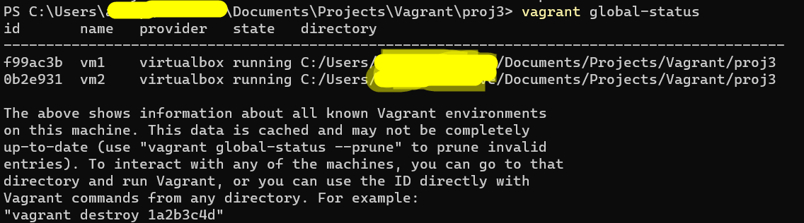
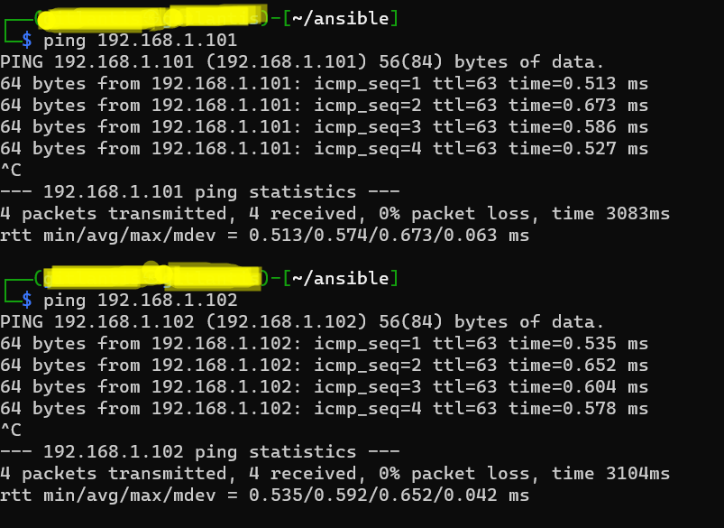
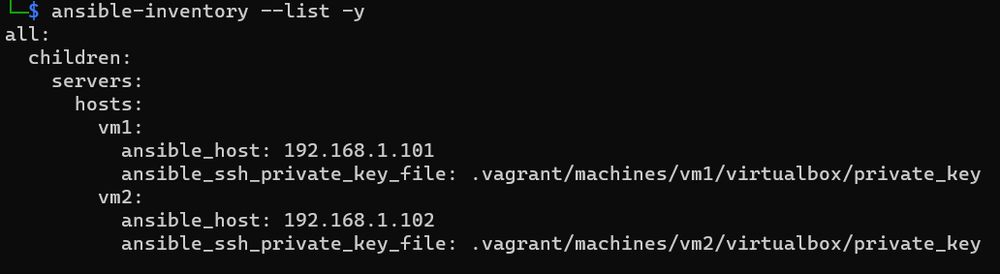
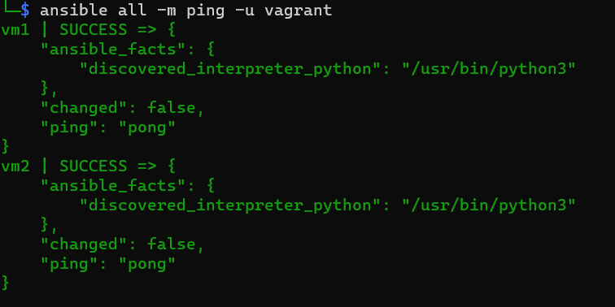
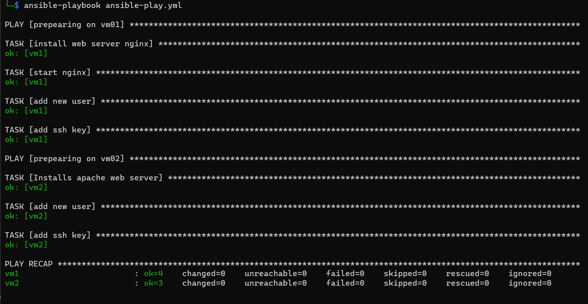
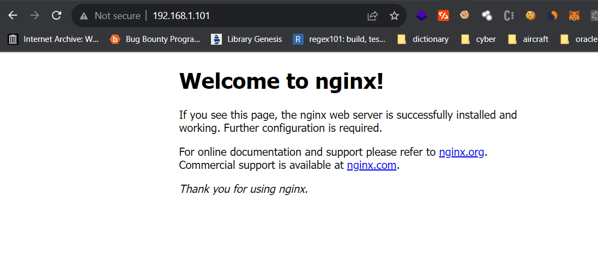
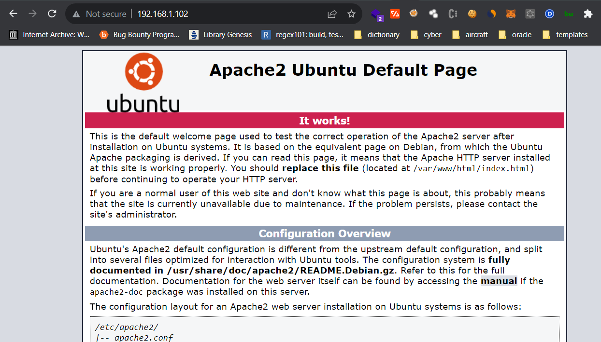
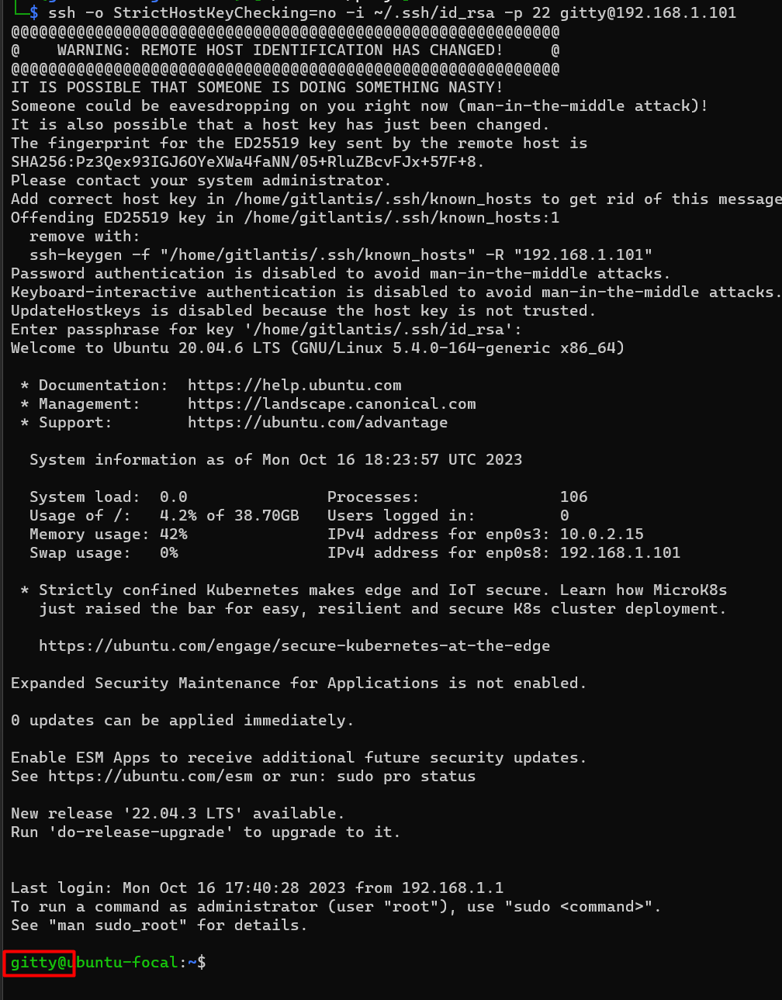
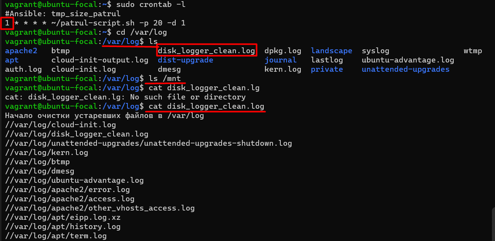

# Vagrant plus Ansible
## Task 1
To communicate with machines it is required configure SSH private keys in first steps,
we can directly upload yml file directly to ```Vagrantfile``` but in the task it is required to firstly create an instance,
and then running andible configuration.

I am running ```vagrant up``` with configurations in ```Vagrantgile``` this is fresh installation, there is no installed any server.



we can find ssh private keys from ```{Vagranfile dir}\.vagrant\machines\{machine name}\virtualbox``` in windows

```cmd
$ ssh -o StrictHostKeyChecking=no -i .vagrant\machines\vm1\virtualbox\private_key -p 22 vagrant@192.168.1.101
$ ssh -o StrictHostKeyChecking=no -i .vagrant\machines\vm2\virtualbox\private_key -p 22 vagrant@192.168.1.102
```

we have to install ansible on linux machine first.

In my PC ```Kali Linux``` is installed as a ```WSL``` that's why my next actions will be done from there.

machines are running



go to ```vagranfile``` directory:

```$ cd {Vagranfile dir}```

we should create disabled ```ansible.cfg``` that we can modify it later

```$ ansible-config init --disabled > ansible.cfg```

###### Inventory file with ssh keys

```$ nano hosts```

```bash
[servers]
vm1 ansible_host=192.168.1.101 ansible_ssh_private_key_file=.vagrant/machines/vm1/virtualbox/private_key
vm2 ansible_host=192.168.1.102 ansible_ssh_private_key_file=.vagrant/machines/vm2/virtualbox/private_key

[servers:vars]
host_key_checking=False
ansible_ssh_extra_args=-o StrictHostKeyChecking=no
```
and we should replace ```inventory=``` value from ```ansible.cfg``` simply to ```hosts```

to check inventory we should run following command:

```$ ansible-inventory --list -y```



test connections with hosts:

```$ ansible all -m ping -u vagrant```
ansible ping also working correctly:



We have to create ssh key on a local machine to add public key to the playbook for a new user.

```$ ssh-keygen```

our public keys wil be generated in ```~/.ssh/id_rsa.pub``` file

created playbook:

```yml
---
# on first server installing nginx with shell paramaters
- name: prepearing on vm01
  hosts: vm1
  remote_user: vagrant
  become: yes # run as admin
  tasks:
    - name: install web server nginx
      apt: name=nginx update_cache=yes state=latest

    - name: start nginx
      service:
        name: nginx
        state: started

    - name: add new user
      user:
        name: gitty
        groups: sudo
        shell: /bin/bash

    - name: add ssh key
      authorized_key:
        user: gitty
        key: "{{ lookup('file', '~/.ssh/id_rsa.pub') }}"

# on second server installing Apache with yaml parameters
- name: prepearing on vm02
  hosts: vm2
  remote_user: vagrant
  become: yes # run as admin
  tasks:
    - name: Installs apache web server
      apt: name=apache2 update_cache=yes state=latest

    - name: add new user
      user:
        name: gitty
        groups: sudo
        shell: /bin/bash

    - name: add ssh key
      authorized_key:
        user: gitty
        key: "{{ lookup('file', '~/.ssh/id_rsa.pub') }}"
```

```$ ansible-playbook ansible-play.yml```



all stepps passed successfully.

### vm1
as we planned running nginx server



### vm2
and here is apache



Let's try to connect our new user which created using ansible:

```$ ssh -o StrictHostKeyChecking=no -i ~/.ssh/id_rsa -p 22 gitty@192.168.1.101 ```



you can see all sources inside of ```1 Task Automation``` folder

## Task 2
I am modifiying anssible script from last task 
and for disk and log clean automation using my olready prepeared script from Linux task

Image describes in a virtual machine created cronjob with the period of 1 min, this period is to demonstrate how it is working.

In ```/var/log``` file created ```disk_logger_clean.log``` which you can see content of file in the last command. We should have one more fiele ```disk_logger_warn.log```, but why it is not exist? 

Because of there is no any mounted devices in VM



All scripts from this task you can see in ```2 Task Automation``` folder
