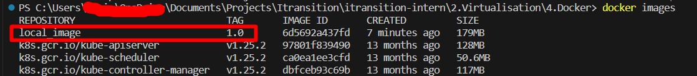
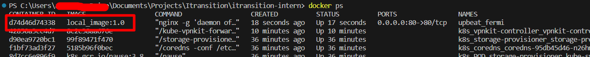
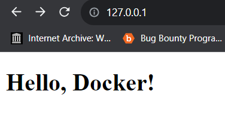

# Docker
createed dockerfile
```docker
FROM ubuntu:20.04
RUN apt update
RUN apt-get install nginx -y
COPY ./files/* /var/www/html #copy all files from files directory to /var/www/html
EXPOSE  80 
STOPSIGNAL SIGTERM
CMD ["nginx", "-g", "daemon off;"]
```
created files folder
in this folder I have already adde ```index.html``` with the content ```Hello, DOcker!```

```$ docker build -t localImage:1.0 .```

check built images

```$ docker images```



```$ docker run -p 80:80/tcp local_image:1.0```

check running images list

```$ docker ps```



and this is our result


