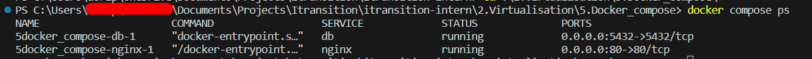
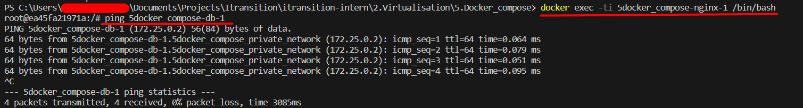
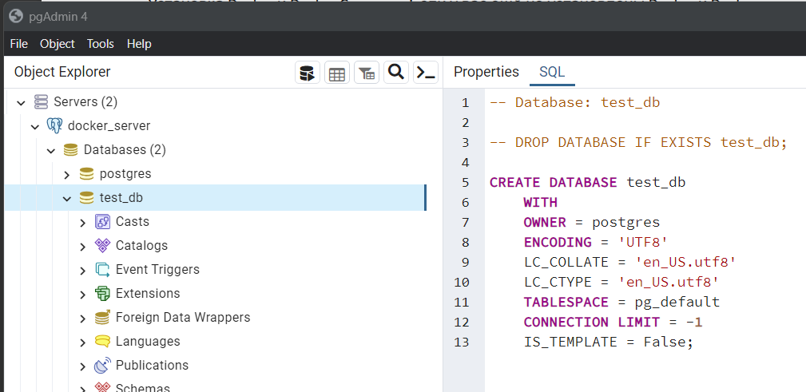

# Docker compose
I have created two Dockerfiles which they help to install ```iputils``` package into images,
this package is needed to check connection with ```ping```  from inside of another image:

```Dockerdb``` is postgres image and ```Dockernginx``` is a nginx image.

```docker
# Dockerdb file
FROM postgres:latest
RUN apt update
RUN apt-get install iputils-ping -y
```

```docker
# Dockernginx file
FROM nginx:latest
RUN apt update
RUN apt-get install iputils-ping -y
``````

now we can compose this images with docker compose

```yml
services:
  nginx:
    build:
      context: ./
      dockerfile: Dockernginx
    ports:
      - 80:80
    volumes:
      - ./files:/usr/share/nginx/html
    networks:
      - private_network
    depends_on:
      - db

  db:
    build:
      context: ./
      dockerfile: Dockerdb
    volumes:
      - ./data:/var/lib/postgresql/data
    ports:
      - "5432:5432" 
    environment:
      - POSTGRES_DB=${POSTGRES_DB}
      - POSTGRES_USER=${POSTGRES_USER}
      - POSTGRES_PASSWORD=${POSTGRES_PASSWORD}
    env_file:
      - .env
    networks:
      - private_network

networks:
  private_network:
```

as you can see every image connecting over ```private_network```

```docker compose ps```

```$ docker compose up```



```docker exec -ti 5docker_compose-nginx-1 /bin/bash```



We have successfull ping process. You can find my result in following image, we can connect to secont image from another one

And I am trying to connect to the image from local machine to



in the database list you can find ```test_db``` database name

and in the following ```nginx``` result

