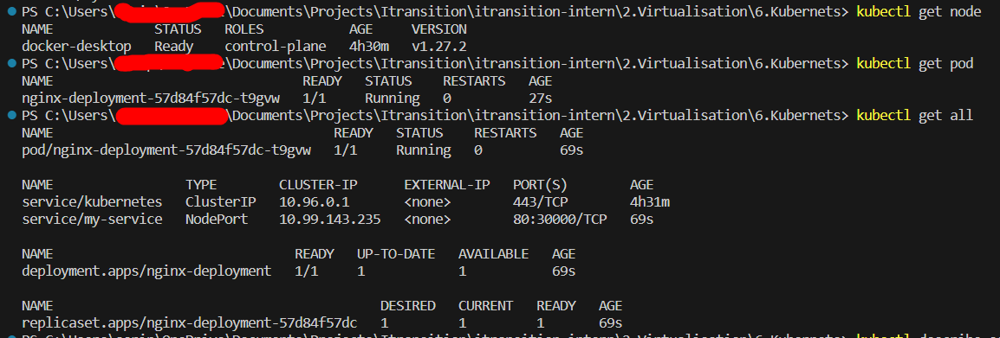
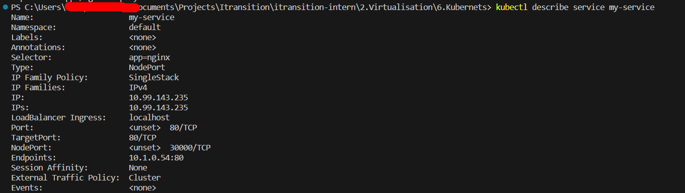
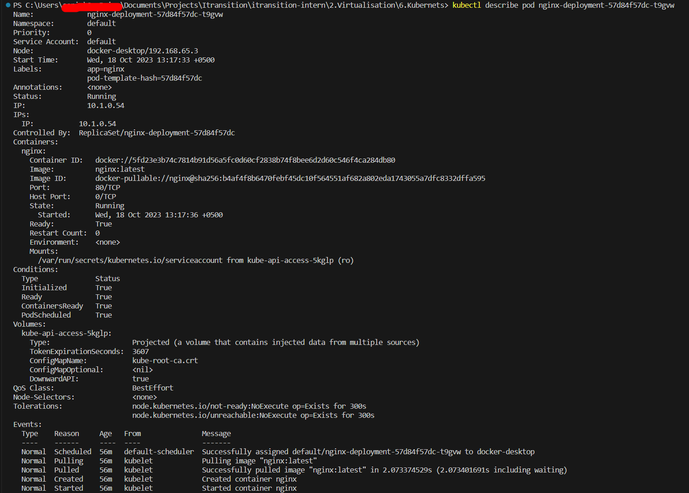
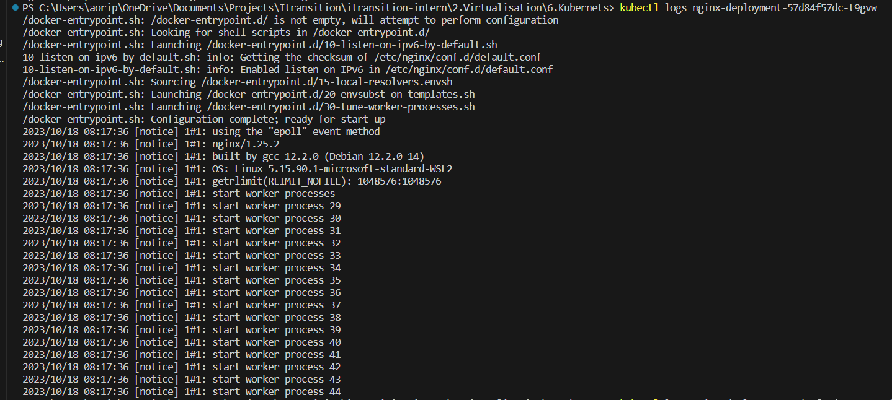
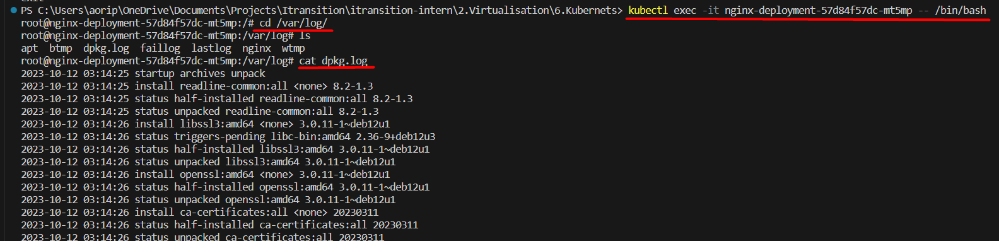
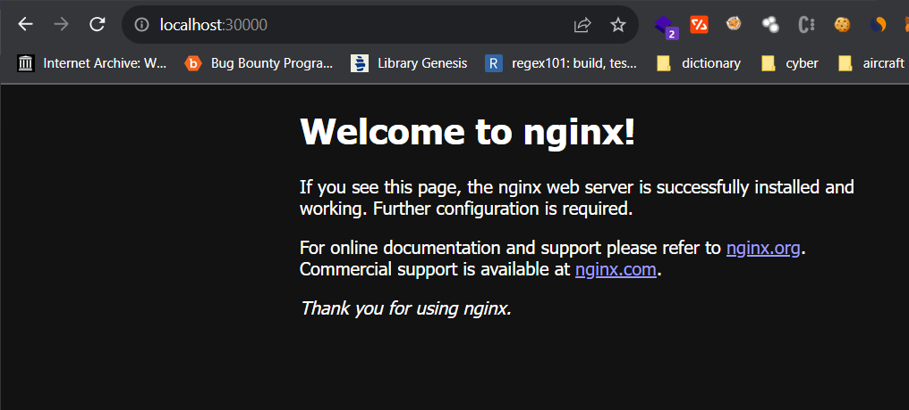
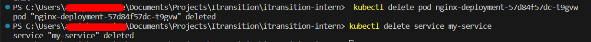

# K8s

In the first, we should create a ```Deployment``` for pod and ```Service``` network configuration.

> **_NOTE:_**  following examples are taken from Kubernets official docummentation

```yml
apiVersion: apps/v1
kind: Deployment
metadata:
  name: nginx-deployment
  labels:
    app: nginx
spec:
  replicas: 1
  selector:
    matchLabels:
      app: nginx
  template:
    metadata:
      labels:
        app: nginx
    spec:
      containers:
      - name: nginx
        image: nginx:latest
        ports:
        - containerPort: 80
---
apiVersion: v1
kind: Service
metadata:
  name: my-service
spec:
  type: NodePort
  selector:
    app: nginx
  ports:
    - protocol: TCP
      port: 80
      targetPort: 80
      nodePort: 30000
```
I am forwarding nodeport to ```:30000``` choosen from default range.

On my computer already Kubernetes is installed and running, that's why I can test this process with it.

```$  kubectl apply -f nginx.yml```



```$ cubectl get all``` gives all informations about pod and service at once.

as you can see pod name is ```nginx-deployment-57d84f57dc-t9gvw``` ans service name is ```my-service```

to get more detailed information about service we can use ```describe``` option of ```kubectl```.



and this is information about pod



how about logs? we should know what is going on backgraund:
if we give ```-f``` argument to ```kubectl log``` we can open strem to continiously listen logs. 



sometimeses we will want to connect remotely to the pod, 
we can do this as following:

```$ kubectl exec -it nginx-deployment-57d84f57dc-mt5mp -- /bin/bash```



as we described earlier our ```my-service``` service forwarding our ```80``` port to ```30000```  



deleting pod and service:

