# Jenkins

First of all we should develope architecture of the solution

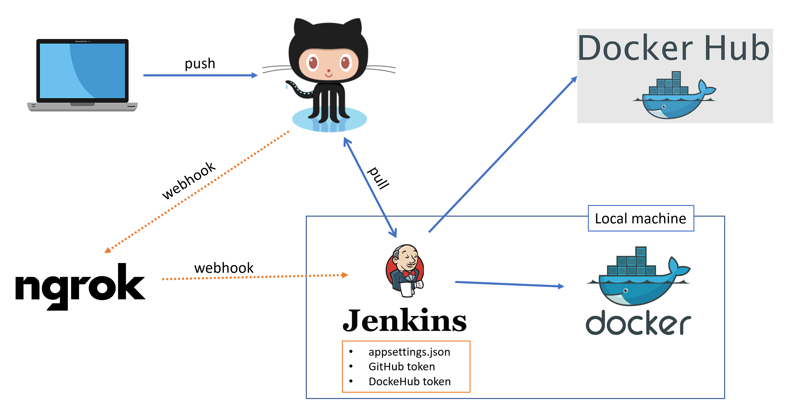

From this image we can see docker containers will be created in a local machine and pushed to the dockerhub, just signal to Jenkins come from github webhook.
In the following example we shall see how this process is realized.

In the beginning, I tried to install jenkins on windows but this was horrible idea, when we work with linux shell commands Jenkins shell commande will come to conflict with terminal. Therefore I installed Jenkins on my WSL Kali machine.

My project was from internship's 4th developers task, which developed by myself. This demonstration contains only backend part of the project.

https://github.com/gitlantis/UserTestAPI.git

this project was private and in the following you can see how credentials are configured, however I shall put project in public at the end of the this task.

we have two branches ```main``` and ```staging```, ```staging``` is used for development and ```main``` for production.

```bash
$ git branch staging
$ git checkout staging
```

## Access tokens
Next step is creating credentials to connect services to each other,
we should add all credentials to Jenkins to authorize to the service

Access token from Dockerhub

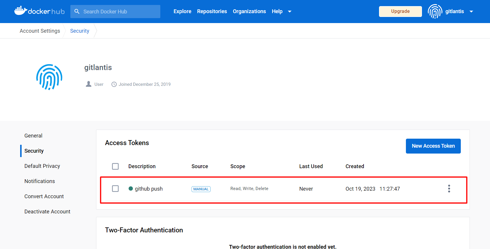

Access token from GitHub

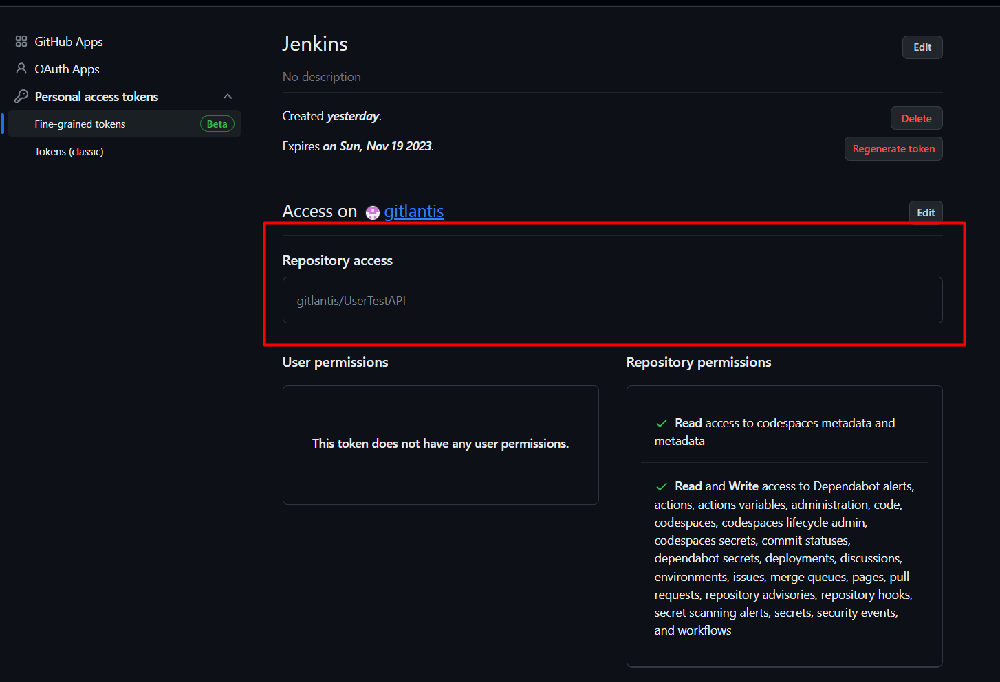

Go to: Dashboard > Manage Jenkins > Credentials > System > Global credentials (unrestricted)
And Create credentials button will help you to add new credential to the Jenkins.

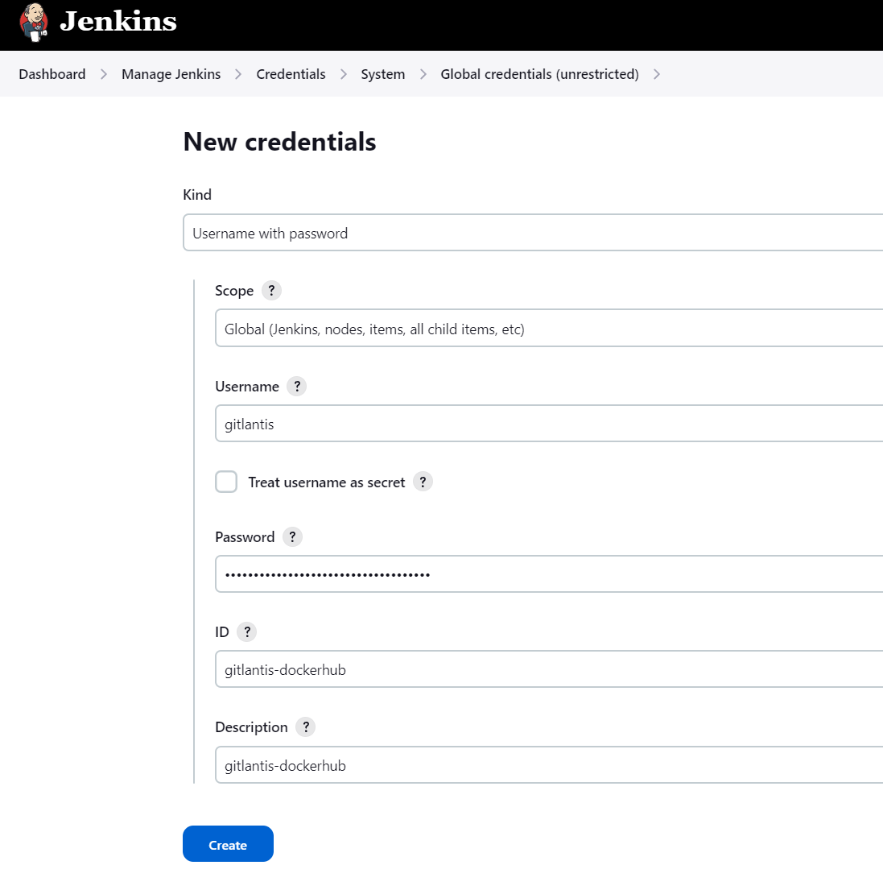

and this is our stored credentials, but here is additional one more variable what is this?

variable ```appsettings.json``` is secure file, this file stores all database connection strings, JWT secure token, password hash.

We can said this is configuration file for the project this file is confidential that's why it is not stored in a github or anywhere.

This file will be replaced when docker build and running

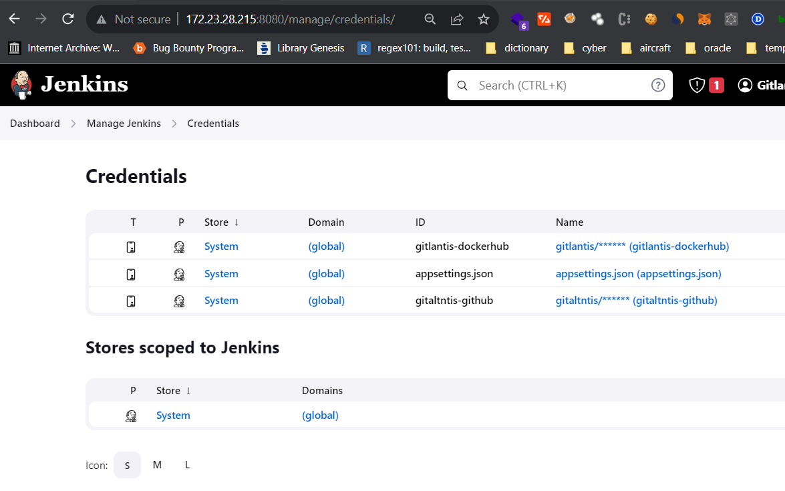

Project's appsettings.json file contains secret keys and variables

## Webhook
To work GitHub webhook, we should somehow make connection between GitHub and local machine.
For this purpose I am useing NGROK tool.

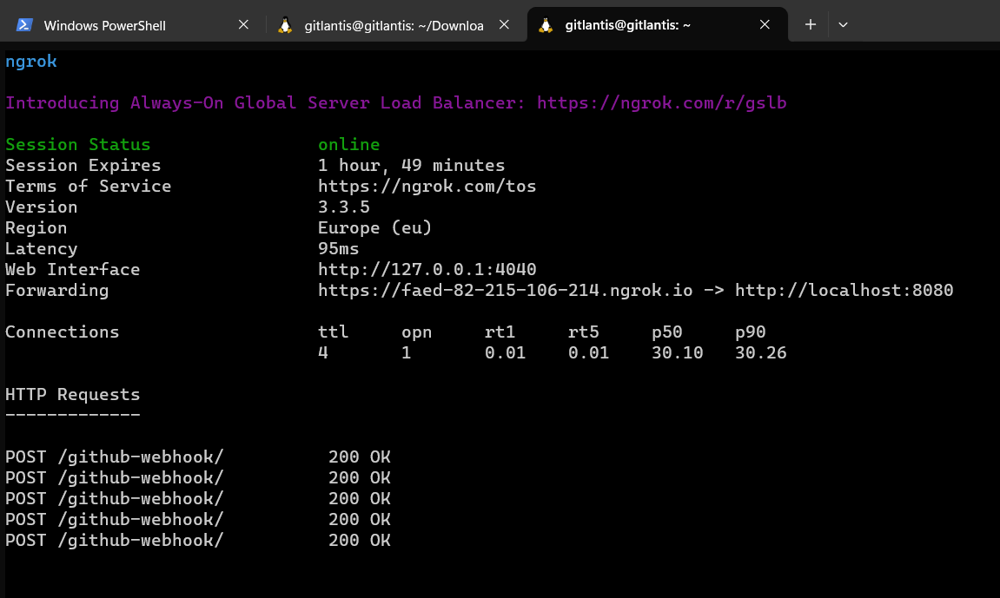

We should point GitHub's webhook to ngrok's address

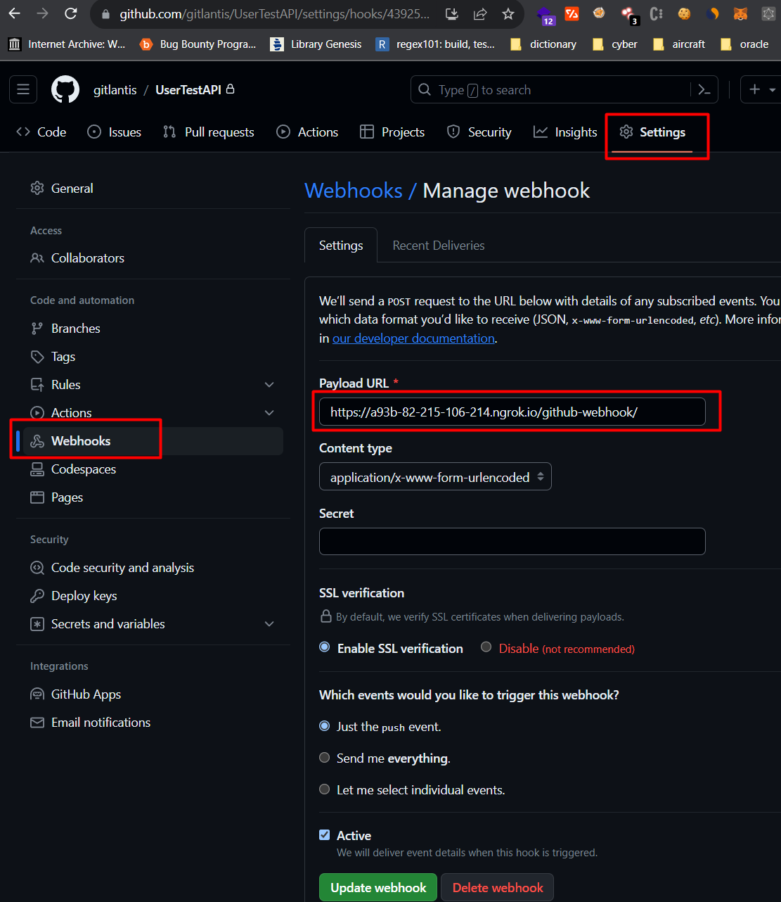

## Dockerfile
this is Dockerfile for .Net

```yml
FROM mcr.microsoft.com/dotnet/sdk:7.0 AS build-env
WORKDIR /App
COPY . ./
RUN dotnet restore
RUN dotnet publish -c Release -o out

FROM mcr.microsoft.com/dotnet/aspnet:7.0
WORKDIR /App

COPY --from=build-env /App/out .

ENTRYPOINT ["dotnet", "UserTestAPI.dll"]
```

## Multibranch pipeline
Sourcecode contains Jenkinsfile that contrls deploy process.

```groovy
pipeline {
    agent any
    options {
        buildDiscarder(logRotator(numToKeepStr: '5'))
    }
    environment {
        DOCKERHUB_CREDENTIALS = credentials('gitlantis-dockerhub')
        PWD = pwd()
        APPSETTINGS = "${PWD}/appsettings.json"
    }
    stages {
        stage('Push staging to dockerhub') {
            when {
                branch 'staging'               
            }
            steps {
                script {
                    withCredentials([file(credentialsId: 'appsettings.json', variable: 'SECRET_FILE_PATH')]) {
                        
                        sh '''
                            ANCESTOR_CKECK=$(docker ps -q --filter ancestor=gitlantis/user-test-api-dev)
                            if [ $ANCESTOR_CKECK ]; then
                                docker stop $ANCESTOR_CKECK
                            fi
                            echo $DOCKERHUB_CREDENTIALS_PSW | docker login -u $DOCKERHUB_CREDENTIALS_USR --password-stdin
                            docker build -t gitlantis/user-test-api-dev:latest -f Dockerfile .
                            docker push gitlantis/user-test-api-dev:latest 
                            docker logout
                            cp $SECRET_FILE_PATH $PWD   
                            chmod 644 $APPSETTINGS
                            docker run -d -p 8081:80 -e ASPNETCORE_HTTP_PORT=http://+:5000 gitlantis/user-test-api-dev:latest
                            ANCESTOR_CKECK=$(docker ps -q --filter ancestor=gitlantis/user-test-api-dev:latest)
                            docker cp $APPSETTINGS $ANCESTOR_CKECK:/App/appsettings.json
                        '''
                    }
                }
            }
        }
        stage('Push main to dockerhub') {
            when {
               branch 'main'               
            }
            steps {
                script {
                    withCredentials([file(credentialsId: 'appsettings.json', variable: 'SECRET_FILE_PATH')]) {
                        sh '''
                            ANCESTOR_CKECK=$(docker ps -q --filter ancestor=gitlantis/user-test-api-prod)
                            if [ $ANCESTOR_CKECK ]; then
                                docker stop $ANCESTOR_CKECK
                            fi
                            echo $DOCKERHUB_CREDENTIALS_PSW | docker login -u $DOCKERHUB_CREDENTIALS_USR --password-stdin
                            docker build -t gitlantis/user-test-api-prod:latest -f Dockerfile . 
                            docker push gitlantis/user-test-api-prod:latest 
                            docker logout
                            cp -f $SECRET_FILE_PATH $PWD
                            chmod 644 $APPSETTINGS
                            docker run -d -p 80:80 -e ASPNETCORE_HTTP_PORT=http://+:5000 gitlantis/user-test-api-prod:latest
                            ANCESTOR_CKECK=$(docker ps -q --filter ancestor=gitlantis/user-test-api-prod:latest)
                            docker cp $APPSETTINGS $ANCESTOR_CKECK:/App/appsettings.json
                        '''
                   }
                }
            }
        }        
    }
}
```
Jenkins wil run our Jenkinsfile automatically and creates job for every branch, evaen we can filter branchs which one should run.

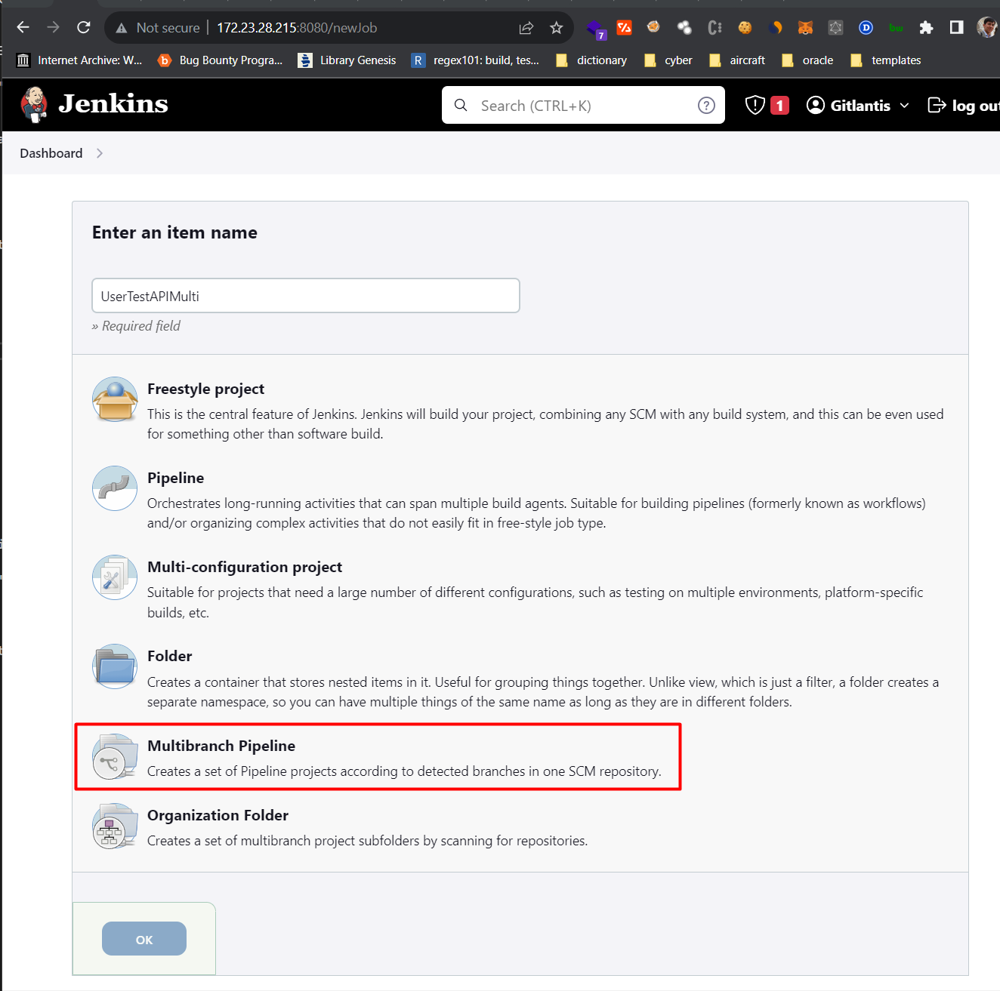

After creating project Jenkins will scan our repository.

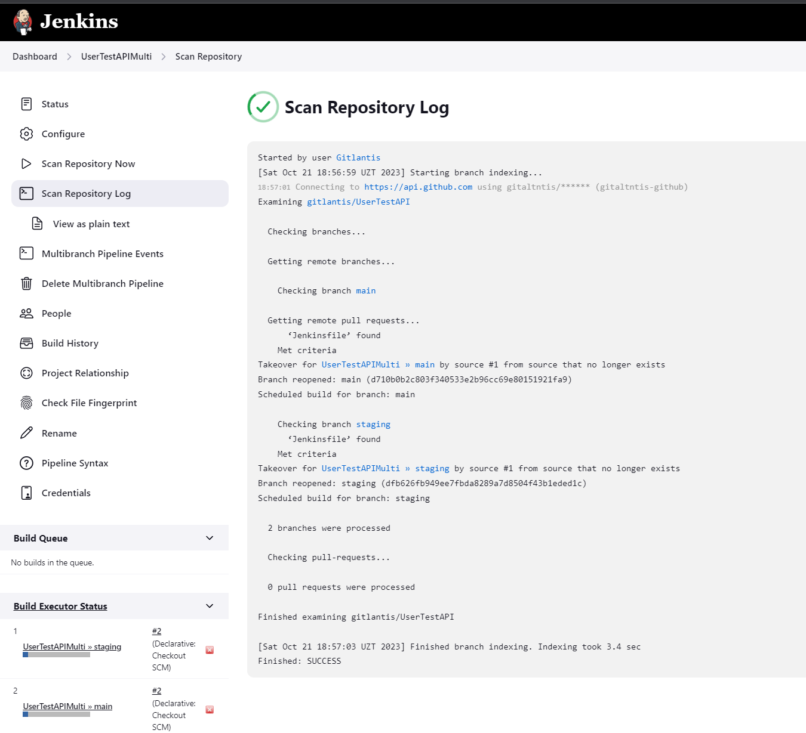

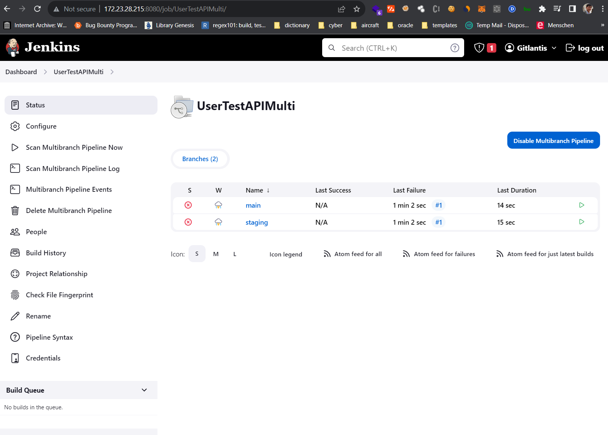

## Main branch
when we push changes to main branch, production image will be created and deployed, it will run on the ```:80``` port

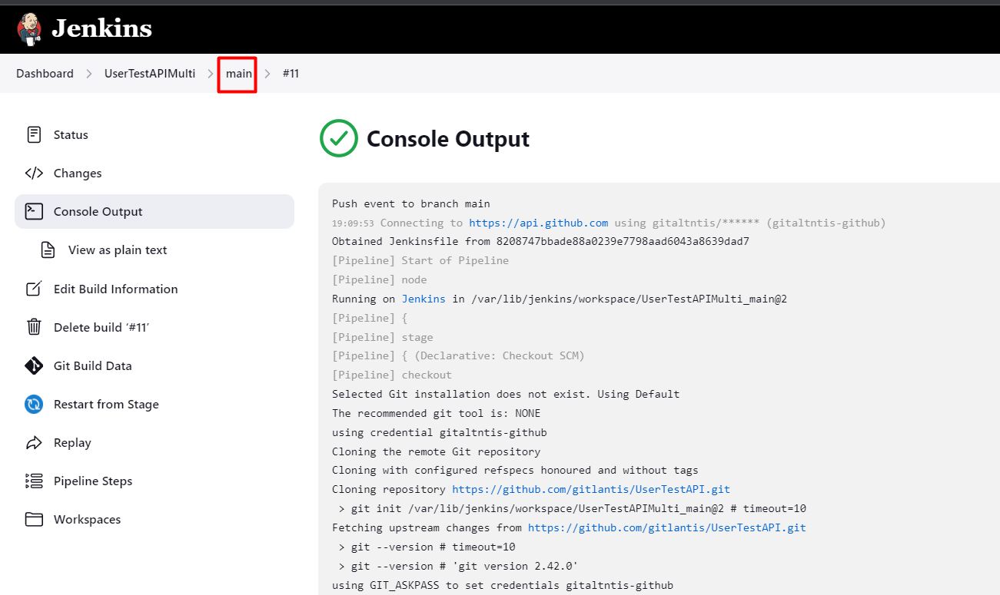

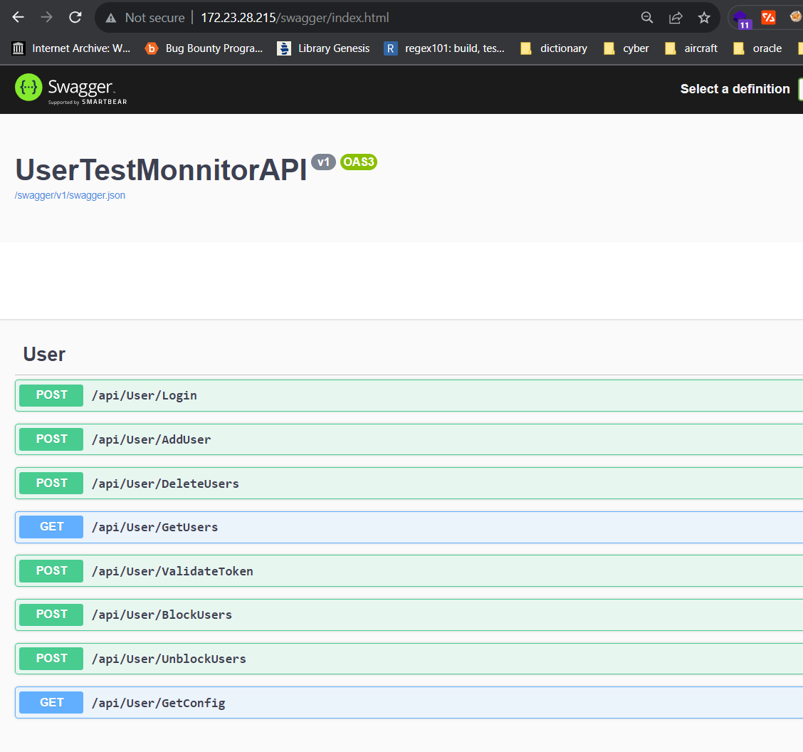

And we push changes to staging branch, development image will be created and deployed, it will run on the ```:8081``` port

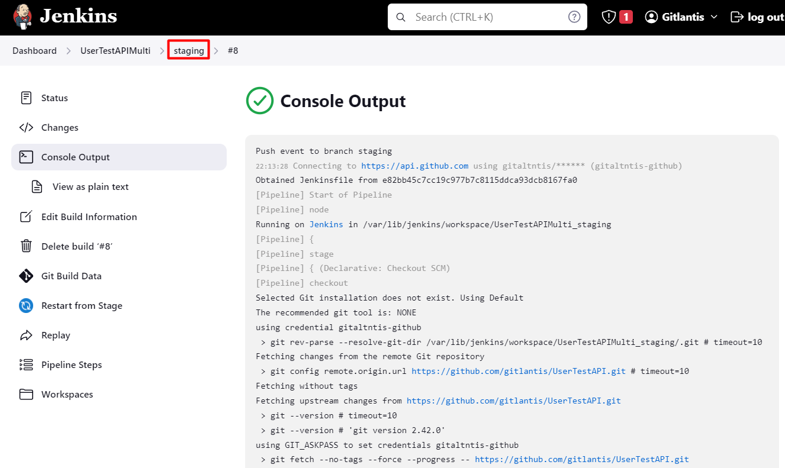

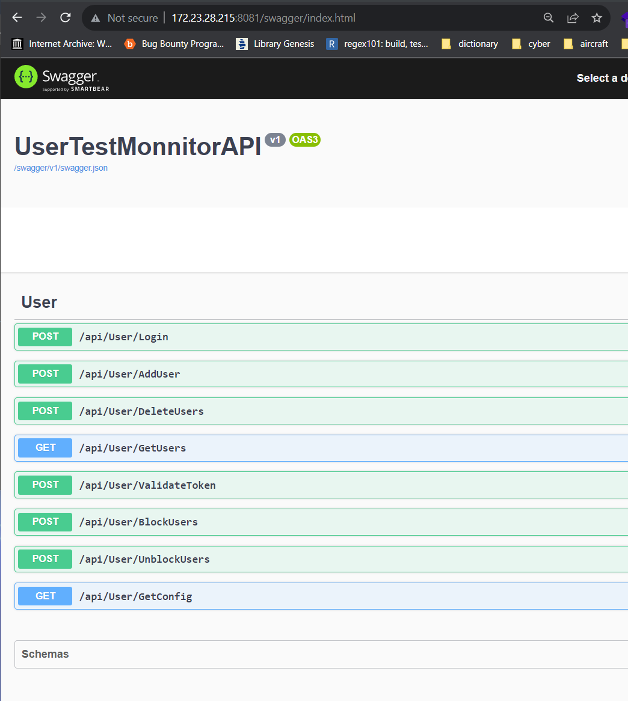

## Docker images
As a result you can see published repositories on a Dockerhub

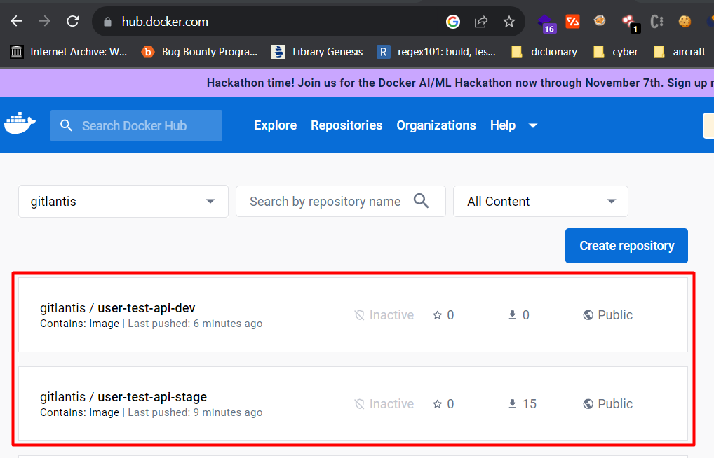