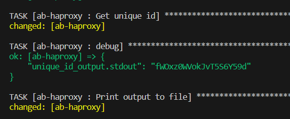

# Ansible

In the following demonstrated task's concept


### Prepearing Vagrant machines

```$ vagrant init```

Here we can see second virtual machin is configured with 2GB of memory and 2 CPU cores, in this machine I am planning to install elasticsearch and logstash, they require mroe resources.

```ruby
Vagrant.configure("2") do |config|
  config.vm.box = "ubuntu/bionic64"
    
  config.vm.define "ab-haproxy" do |vm1|
    vm1.vm.network "private_network", ip: "192.168.1.101"
  end

  config.vm.define "ab-logstash" do |vm2|
    vm2.vm.network "private_network", ip: "192.168.1.102"
    
    #elasctic search requires more resource
    vm2.vm.provider "virtualbox" do |vb|
      vb.memory = "2048" 
      vb.cpus = 2
    end
  end
  
  config.vm.define "ab-webui" do |vm3|
    vm3.vm.network "private_network", ip: "192.168.1.103"
  end  
  
  config.vm.provider "virtualbox" do |vb|
    vb.memory = "1024"
    vb.cpus = 1
  end

  config.vm.provision "shell", inline: <<-SHELL
    echo $(shuf -er -n20  {A..Z} {a..z} {0..9} | tr -d '\n') > /etc/unique_id
  SHELL
end
```

following script generates uique id for every VM:

```ruby
config.vm.provision "shell", inline: <<-SHELL
  echo $(shuf -er -n20  {A..Z} {a..z} {0..9} | tr -d '\n') > /etc/unique_id
SHELL
```

```$ vagrant up```


### Prepearing GitHub repositories


All repositories are created as ```role``` and includes own ```readme```

https://github.com/gitlantis/ab-haproxy

https://github.com/gitlantis/ab-logstash

https://github.com/gitlantis/ab-webui

### Ansible configuration
As required in a tasr this is unique id of a machine which generated by script
#### haproxy machine


#### haproxy logstash


#### haproxy webui


### summary result


### this is kibana and nginx server


### this is haproxy server working as loadbalancer


#### Logs
thous are machines unique id ```ini``` files which requested in to task.
They will be fetched into local machine's ```/tmp``` directory


