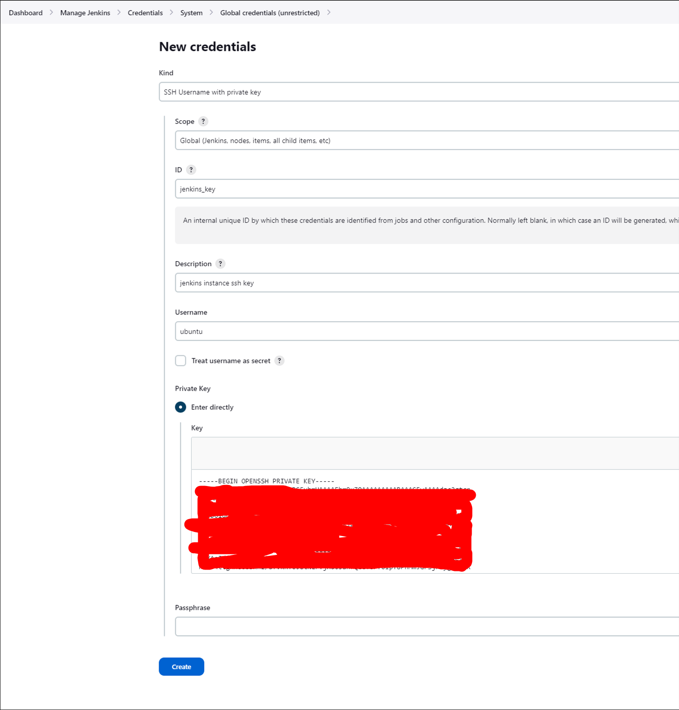

# Nginx with Ansible
Task was to create one revers proxy to be reversed to apache and nginx virtual servers, to complete this task I used Vagrant and Ansible, We can se task consept in the following:


Vm orchestration file is in the ```Nginx-Apache/Vagrantfile``` 
```yml
Vagrant.configure("2") do |config|
  config.vm.box = "ubuntu/bionic64"

  config.vm.define "nginx-cache" do |vm1|
    vm1.vm.network "private_network", ip: "192.168.1.101"
  end  

  config.vm.define "apache-cache" do |vm2|
    vm2.vm.network "private_network", ip: "192.168.1.102"
  end  

  config.vm.define "nginx-reverse" do |vm3|
    vm3.vm.network "private_network", ip: "192.168.1.103"
  end  

  config.vm.provider "virtualbox" do |vb|
    vb.memory = "2048"
    vb.cpus = 2
  end

end
```
```Nginx-Apache/nginx-cache.yml``` is Ansible configuration file ```nginx-cache``` VM, in this machine will run nginxcache configured OS:

```yml
---
- name: Install and Configure Nginx cache 
  hosts: nginx-cache
  remote_user: vagrant  
  become: yes

  tasks:
    - name: Update APT package cache
      apt:
        update_cache: yes

    - name: Install Nginx
      apt:
        name: nginx
        state: present

    - name: Create directory for Nginx cache
      file:
        path: /var/cache/nginx
        state: directory
        mode: '0777'
    
    - name: Set ownership of /var/cache/nginx
      ansible.builtin.file:
        path: /var/cache/nginx
        owner: www-data
        group: www-data
        recurse: yes

    - name: Copy nginx-cache.conf to /etc/nginx/sites-available/default
      copy:
        src: configs/nginx-cache.conf
        dest: /etc/nginx/sites-available/default

    - name: Copy clean.sh to the home directory
      copy:
        src: scripts/clean.sh
        dest: /home/vagrant/clean.sh
        mode: 'a+x'

    - name: Add a cron job to clean cache
      cron:
        name: Clean NGINX cache
        minute: 0
        hour: 0
        job: "/home/vagrant/clean.sh -s +5M -d 14"
        state: present

    - name: Retart Nginx service
      service:
        name: nginx
        state: restarted
```
```Nginx-Apache/apache-cache.yml``` is Ansible configuration file ```apache-cache``` VM, in this machine will run apachecache configured OS:

```yml
---
- name: Configure Apache with Cache
  hosts: apache-cache
  remote_user: vagrant
  become: yes

  tasks:
    - name: Update APT package cache
      apt:
        update_cache: yes

    - name: Install Apache2 and Apache2 utilities
      apt:
        name: "{{ item }}"
        state: present
      with_items:
        - apache2
        - apache2-utils

    - name: Create cache directory
      file:
        path: /var/cache/apache_cache
        state: directory
        mode: '0777'

    - name: Set ownership of /var/cache/nginx
      ansible.builtin.file:
        path: /var/cache/nginx
        owner: www-data
        group: www-data
        recurse: yes

    - name: Copy apache-cache.conf to /etc/apache2/sites-available/000-default.conf
      copy:
        src: configs/apache-cache.conf
        dest: /etc/apache2/sites-available/000-default.conf

    - name: Replace before the expression till the begin of the file (requires Ansible >= 2.4)
      ansible.builtin.replace:
        path: /etc/apache2/ports.conf
        regexp: 'Listen 80\n'
        replace: 'Listen 8080\n'

    - name: Enable Apache2 cache and cache_disk modules
      command: "a2dismod {{ item }}"
      with_items:
        - proxy_http2
        
    - name: Enable Apache2 cache and cache_disk modules
      command: "a2enmod {{ item }}"
      with_items:
        - cache
        - cache_disk
        - headers
        - mpm_event     
        - proxy_http 
        
    - name: Copy clean.sh to the home directory
      copy:
        src: scripts/clean.sh
        dest: /home/vagrant/clean.sh
        mode: 'a+x'
        
    - name: Add a cron job to clean Apache cache
      cron:
        name: Clean Apache cache
        minute: 0
        hour: 0
        job: "/home/vagrant/clean.sh -s +5M -d 14"
        state: present

    - name: Restart Apache service
      service:
        name: apache2
        state: restarted
```
```Nginx-Apache/nginx-reverse.yml``` is Ansible configuration file ```nginx-reverse``` VM, in this machine will run nginxreverse proxy configured OS:

```yml
---
- name: Configuring Reverse proxy
  hosts: nginx-reverse
  remote_user: vagrant  
  become: yes 

  tasks:
    - name: Update APT package cache
      apt:
        update_cache: yes

    - name: Install Nginx
      apt:
        name: nginx
        state: present

    - name: Copy nginx-reverse.conf to /etc/nginx/sites-available/default
      copy:
        src: configs/nginx-reverse.conf
        dest: /etc/nginx/sites-available/default

    - name: Copy clean.sh to the home directory
      copy:
        src: scripts/clean.sh
        dest: /home/vagrant/clean.sh
        mode: 'a+x'

    - name: Add a cron job to clean Nginx cache
      cron:
        name: Clean Nginx cache
        minute: 0
        hour: 0
        job: "/home/vagrant/clean.sh -s +5M -d 14"
        state: present

    - name: Restart Nginx service
      service:
        name: nginx
        state: restarted
```
and following  ```Nginx-Apache/playbook.yml``` will run all playbooks at once:

```yml
---
- import_playbook: nginx-cache.yml
- import_playbook: apache-cache.yml
- import_playbook: nginx-reverse.yml
```

```scripts/clean.sh``` is crontab script that will runs every dat on 00:00

```configs``` folder contains configuration files for all servers

```kubectl get svc --namespace default -w my-release-wordpress```

# Minikube Helm and server version dislosure
```└─$ minikube start```

```└─$ helm install my-release oci://registry-1.docker.io/bitnamicharts/wordpress```


server versions were not disclosed from beginning 

to demonstrate how disclose proces work I planned to show reverse solution.

To pod name running on minikube:

```└─$ kubectl get pods```

I tried to connect virtual machine using bash and change ```httpd.conf``` but it didn't work, because bitnami helm script will remove root access after installing and configuring VM:

```└─$ kubectl exec -i -t my-release-wordpress-xxxxxxxx-xxxxx -- /bin/bash```

That's why I have to reisntall image with new configurations

From bitnami wordpress chart docummentation I found option ```apacheConfiguration```, that will replace apache configuration

and I changed  ```ServerTokens Prod``` option to ```Full``` in a ```httpd.conf``` file to see version of Apache server:

```└─$ helm uninstall my-release```

```└─$ helm install my-release oci://registry-1.docker.io/bitnamicharts/wordpress --set-file apacheConfiguration=httpd.conf```
 
file will be saved in ```/opt/bitnami/apache2/conf/bitnami/bitnami.conf```

and this is my result:


# Категория Linux

create 4 image files fo loopback devices:
```bsh
dd if=/dev/zero of=file1.img bs=1G count=1
dd if=/dev/zero of=file2.img bs=1G count=1
dd if=/dev/zero of=file3.img bs=1G count=1
dd if=/dev/zero of=file4.img bs=1G count=1
```

create loopback devices:
```bash
sudo losetup -fP file1.img
sudo losetup -fP file2.img
sudo losetup -fP file3.img
sudo losetup -fP file4.img
```


create vlume groups:
```bash
sudo pvcreate /dev/loop0 /dev/loop1
sudo pvcreate /dev/loop3 /dev/loop4
```


create volume group:

```sudo vgcreate my_volume_group /dev/loop0 /dev/loop1```

create logical volume:

```sudo lvcreate -L 1G -n my_logical_volume my_volume_group```

create a file system mkfs.ext3

```sudo mkfs.ext3 /dev/my_volume_group/my_logical_volume```


mount file system:

```bash
sudo mkdir /mnt/my_mount_point
sudo mount /dev/my_volume_group/my_logical_volume /mnt/my_mount_point
```

check the size of file system:

```df -h```


add the remaining devices to the volume group:

```sudo vgextend my_volume_group /dev/loop3 /dev/loop4```

resize logical volume:

```sudo lvresize -L +1G /dev/my_volume_group/my_logical_volume```

and resize the file system:

```sudo resize2fs /dev/my_volume_group/my_logical_volume```

now our volume is taking 2GB size:


# Jenkins

I have created Jenkins repository: https://github.com/gitlantis/5_task.git

repository contains only Jenkins file:
```jenkins
pipeline {
    agent any    
    stages {
        stage('Deploy to Staging') {
            steps {
                sshagent(['jenkins_key']) {
                    sh 'ssh -o StrictHostKeyChecking=no -L $(pwd)/docker.sock:/var/run/docker.sock ubuntu@172.31.27.102 "docker run hello-world"'
                }
            }        
        }
    }
}

```

generate ssh key in a jenkins server:

```ssh-keygen -t rsa -b 4096 -f jenkins_key```

Copy ```jenkins_key``` public key into trusted keys list in ```worker-docker``` server

Create ```Global credentials``` first and copy ```jenkins_key.pem``` into New credentials



I have used private IP ```172.31.27.102``` of ```worker-docker``` server that it will be internal connection in the AWS

We can run it on Jenkis server using ```Multibranch pipeline```


and this is our final result

