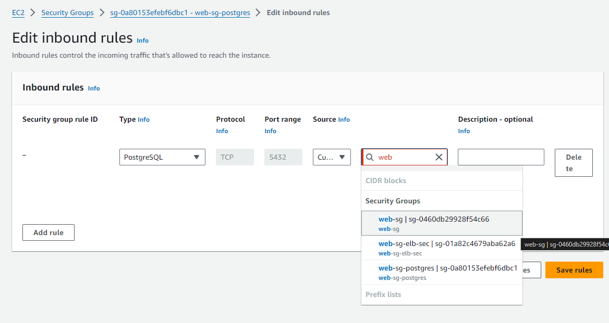
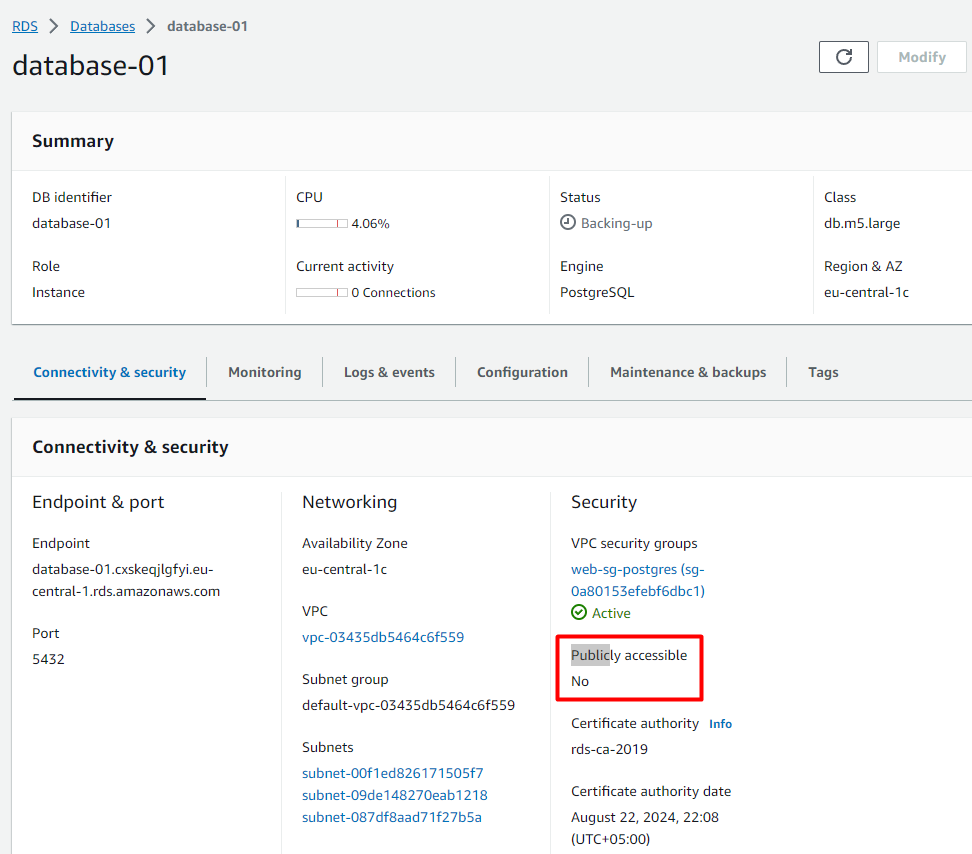
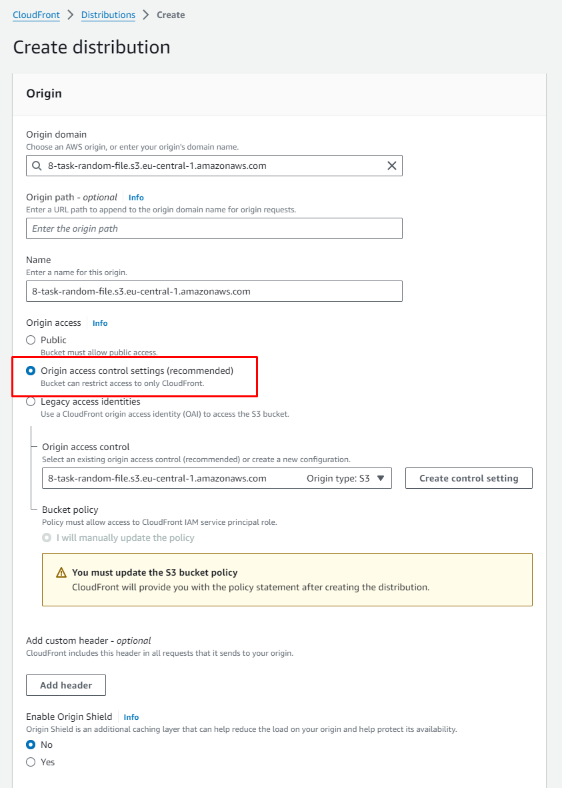
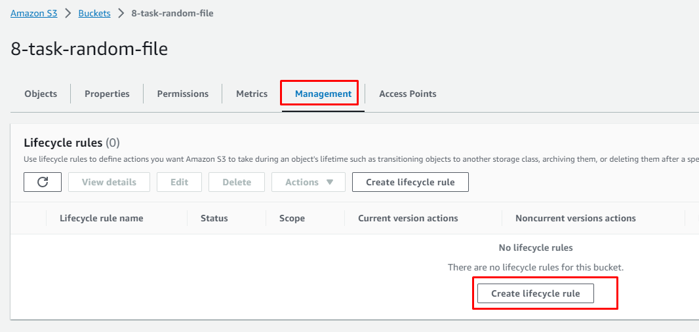

# 1 AWS Basics
### 1. create VPC

```bash
└─$ aws ec2 create-vpc --cidr-block 10.0.0.0/16
```

<details>
<summary>result</summary>

```json
{
    "Vpc": {
        "CidrBlock": "10.0.0.0/16",
        "DhcpOptionsId": "dopt-e2b73188",
        "State": "pending",
        "VpcId": "vpc-03435db5464c6f559",
        "OwnerId": "252083451373",
        "InstanceTenancy": "default",
        "Ipv6CidrBlockAssociationSet": [],
        "CidrBlockAssociationSet": [
            {
                "AssociationId": "vpc-cidr-assoc-08790ba8f2de2adf8",
                "CidrBlock": "10.0.0.0/16",
                "CidrBlockState": {
                    "State": "associated"
                }
            }
        ],
        "IsDefault": false
    }
}
```

</details>

create public sub network:

```bash
└─$ aws ec2 create-subnet --vpc-id vpc-03435db5464c6f559 --cidr-block 10.0.1.0/24 --availability-zone eu-central-1a
```

<details>
<summary>result</summary>

```json
{
    "Subnet": {
        "AvailabilityZone": "eu-central-1a",
        "AvailabilityZoneId": "euc1-az2",
        "AvailableIpAddressCount": 251,
        "CidrBlock": "10.0.1.0/24",
        "DefaultForAz": false,
        "MapPublicIpOnLaunch": false,
        "State": "available",
        "SubnetId": "subnet-087df8aad71f27b5a",
        "VpcId": "vpc-03435db5464c6f559",
        "OwnerId": "252083451373",
        "AssignIpv6AddressOnCreation": false,
        "Ipv6CidrBlockAssociationSet": [],
        "SubnetArn": "arn:aws:ec2:eu-central-1:252083451373:subnet/subnet-087df8aad71f27b5a",
        "EnableDns64": false,
        "Ipv6Native": false,
        "PrivateDnsNameOptionsOnLaunch": {
            "HostnameType": "ip-name",
            "EnableResourceNameDnsARecord": false,
            "EnableResourceNameDnsAAAARecord": false
        }
    }
}
```

</details>

```bash
└─$ aws ec2 create-subnet --vpc-id vpc-03435db5464c6f559 --cidr-block 10.0.2.0/24 --availability-zone eu-central-1b
```

<details>
<summary>result</summary>

```json
{
    "Subnet": {
        "AvailabilityZone": "eu-central-1b",
        "AvailabilityZoneId": "euc1-az3",
        "AvailableIpAddressCount": 251,
        "CidrBlock": "10.0.2.0/24",
        "DefaultForAz": false,
        "MapPublicIpOnLaunch": false,
        "State": "available",
        "SubnetId": "subnet-09de148270eab1218",
        "VpcId": "vpc-03435db5464c6f559",
        "OwnerId": "252083451373",
        "AssignIpv6AddressOnCreation": false,
        "Ipv6CidrBlockAssociationSet": [],
        "SubnetArn": "arn:aws:ec2:eu-central-1:252083451373:subnet/subnet-09de148270eab1218",
        "EnableDns64": false,
        "Ipv6Native": false,
        "PrivateDnsNameOptionsOnLaunch": {
            "HostnameType": "ip-name",
            "EnableResourceNameDnsARecord": false,
            "EnableResourceNameDnsAAAARecord": false
        }
    }
}
```

</details>

create private sub network:

```bash
└─$ aws ec2 create-subnet --vpc-id vpc-03435db5464c6f559 --cidr-block 10.0.3.0/24 --availability-zone eu-central-1c
```

<details>
<summary>result</summary>

```json
{
    "Subnet": {
        "AvailabilityZone": "eu-central-1c",
        "AvailabilityZoneId": "euc1-az1",
        "AvailableIpAddressCount": 251,
        "CidrBlock": "10.0.3.0/24",
        "DefaultForAz": false,
        "MapPublicIpOnLaunch": false,
        "State": "available",
        "SubnetId": "subnet-00f1ed826171505f7",
        "VpcId": "vpc-03435db5464c6f559",
        "OwnerId": "252083451373",
        "AssignIpv6AddressOnCreation": false,
        "Ipv6CidrBlockAssociationSet": [],
        "SubnetArn": "arn:aws:ec2:eu-central-1:252083451373:subnet/subnet-00f1ed826171505f7",
        "EnableDns64": false,
        "Ipv6Native": false,
        "PrivateDnsNameOptionsOnLaunch": {
            "HostnameType": "ip-name",
            "EnableResourceNameDnsARecord": false,
            "EnableResourceNameDnsAAAARecord": false
        }
    }
}
```

</details>


create route table 
```bash 
└─$ aws ec2 create-route-table --vpc-id vpc-03435db5464c6f559
```

<details>
<summary>result</summary>

```json
{
    "RouteTable": {
        "Associations": [],
        "PropagatingVgws": [],
        "RouteTableId": "rtb-0596d0285406f4044",
        "Routes": [
            {
                "DestinationCidrBlock": "10.0.0.0/16",
                "GatewayId": "local",
                "Origin": "CreateRouteTable",
                "State": "active"
            }
        ],
        "Tags": [],
        "VpcId": "vpc-03435db5464c6f559",
        "OwnerId": "252083451373"
    }
}
```

</details>

assign public subnet to the route table
```bash
└─$ aws ec2 associate-route-table --subnet-id subnet-087df8aad71f27b5a --route-table-id rtb-0596d0285406f4044
{
    "AssociationId": "rtbassoc-0dda6a9a088ba0985",
    "AssociationState": {
        "State": "associated"
    }
}
└─$ aws ec2 associate-route-table --subnet-id subnet-09de148270eab1218 --route-table-id rtb-0596d0285406f4044
{
    "AssociationId": "rtbassoc-05dc5c03e0e3c1582",
    "AssociationState": {
        "State": "associated"
    }
}
└─$ aws ec2 associate-route-table --subnet-id subnet-00f1ed826171505f7 --route-table-id rtb-0596d0285406f4044 
{
    "AssociationId": "rtbassoc-0a376921ba197d33e",
    "AssociationState": {
        "State": "associated"
    }
}
```

configure ACL for private subnet

```bash
└─$ aws ec2 create-network-acl --vpc-id vpc-03435db5464c6f559
```

<details>
<summary>result</summary>

```json
{
    "NetworkAcl": {
        "Associations": [],
        "Entries": [
            {
                "CidrBlock": "0.0.0.0/0",
                "Egress": true,
                "IcmpTypeCode": {},
                "PortRange": {},
                "Protocol": "-1",
                "RuleAction": "deny",
                "RuleNumber": 32767
            },
            {
                "CidrBlock": "0.0.0.0/0",
                "Egress": false,
                "IcmpTypeCode": {},
                "PortRange": {},
                "Protocol": "-1",
                "RuleAction": "deny",
                "RuleNumber": 32767
            }
        ],
        "IsDefault": false,
        "NetworkAclId": "acl-062c648e7e54d411e",
        "Tags": [],
        "VpcId": "vpc-03435db5464c6f559",
        "OwnerId": "252083451373"
    }
}
```
</details>

inbound and outbound disabled


ACL is updated for last subnet


### 2. Create security group

create security group ```web-sg``` for VPC


### 3. Generate SSH key
Generate ssh key for aws instances

```ssh-keygen -t rsa -b 4096 -f ~/.ssh/web-sg-key.pem```

we will set pulblic key before creating EC2 instance

### 4. EC2
a. create instance one of public subnetwork
it is important to show VPC and subnet for instance 


or during the using command we have to specify parameters as following:

```bash
 └─$ aws ec2 run-instances --key-name web-sg01_ --image-id ami-06dd92ecc74fdfb36 --instance-type t2.micro --subnet-id subnet-087df8aad71f27b5a --key-name web-sg-key --security-group-ids sg-0460db29928f54c66 --region eu-central-1 --associate-public-ip-address
```

<details>
<summary>result</summary>

```json
{
    "Groups": [],
    "Instances": [
        {
            "AmiLaunchIndex": 0,
            "ImageId": "ami-06dd92ecc74fdfb36",
            "InstanceId": "i-04abb5c38b1b11a27",
            "InstanceType": "t2.micro",
            "KeyName": "web-sg-key",
            "LaunchTime": "2023-11-14T13:33:45+00:00",
            "Monitoring": {
                "State": "disabled"
            },
            "Placement": {
                "AvailabilityZone": "eu-central-1a",
                "GroupName": "",
                "Tenancy": "default"
            },
            "PrivateDnsName": "ip-10-0-1-189.eu-central-1.compute.internal",
            "PrivateIpAddress": "10.0.1.189",
            "ProductCodes": [],
            "PublicDnsName": "",
            "State": {
                "Code": 0,
                "Name": "pending"
            },
            "StateTransitionReason": "",
            "SubnetId": "subnet-087df8aad71f27b5a",
            "VpcId": "vpc-03435db5464c6f559",
            "Architecture": "x86_64",
            "BlockDeviceMappings": [],
            "ClientToken": "8c7e0321-2d17-44d6-bbac-1a1afab60483",
            "EbsOptimized": false,
            "EnaSupport": true,
            "Hypervisor": "xen",
            "NetworkInterfaces": [
                {
                    "Attachment": {
                        "AttachTime": "2023-11-14T13:33:45+00:00",
                        "AttachmentId": "eni-attach-0d13186037ab11ad1",
                        "DeleteOnTermination": true,
                        "DeviceIndex": 0,
                        "Status": "attaching",
                        "NetworkCardIndex": 0
                    },
                    "Description": "",
                    "Groups": [
                        {
                            "GroupName": "web-sg",
                            "GroupId": "sg-0460db29928f54c66"
                        }
                    ],
                    "Ipv6Addresses": [],
                    "MacAddress": "02:2c:f6:c8:2d:15",
                    "NetworkInterfaceId": "eni-0a73ff775bb2720c6",
                    "OwnerId": "252083451373",
                    "PrivateIpAddress": "10.0.1.189",
                    "PrivateIpAddresses": [
                        {
                            "Primary": true,
                            "PrivateIpAddress": "10.0.1.189"
                        }
                    ],
                    "SourceDestCheck": true,
                    "Status": "in-use",
                    "SubnetId": "subnet-087df8aad71f27b5a",
                    "VpcId": "vpc-03435db5464c6f559",
                    "InterfaceType": "interface"
                }
            ],
            "RootDeviceName": "/dev/sda1",
            "RootDeviceType": "ebs",
            "SecurityGroups": [
                {
                    "GroupName": "web-sg",
                    "GroupId": "sg-0460db29928f54c66"
                }
            ],
            "SourceDestCheck": true,
            "StateReason": {
                "Code": "pending",
                "Message": "pending"
            },
            "VirtualizationType": "hvm",
            "CpuOptions": {
                "CoreCount": 1,
                "ThreadsPerCore": 1
            },
            "CapacityReservationSpecification": {
                "CapacityReservationPreference": "open"
            },
            "MetadataOptions": {
                "State": "pending",
                "HttpTokens": "optional",
                "HttpPutResponseHopLimit": 1,
                "HttpEndpoint": "enabled",
                "HttpProtocolIpv6": "disabled",
                "InstanceMetadataTags": "disabled"
            },
            "EnclaveOptions": {
                "Enabled": false
            },
            "PrivateDnsNameOptions": {
                "HostnameType": "ip-name",
                "EnableResourceNameDnsARecord": false,
                "EnableResourceNameDnsAAAARecord": false
            },
            "MaintenanceOptions": {
                "AutoRecovery": "default"
            },
            "CurrentInstanceBootMode": "legacy-bios"
        }
    ],
    "OwnerId": "252083451373",
    "ReservationId": "r-06b335d7471d6b1f1"
}
```

</details>

b. Instance name is: web-sg02

```bash
└─$ aws ec2 run-instances --key-name web-sg02_ --image-id ami-06dd92ecc74fdfb36 --instance-type t2.micro --subnet-id subnet-09de148270eab1218 --key-name web-sg-key --security-group-ids sg-0460db29928f54c66 --region eu-central-1 --associate-public-ip-
```

<details>
<summary>result</summary>

```json
address
{
    "Groups": [],
    "Instances": [
        {
            "AmiLaunchIndex": 0,
            "ImageId": "ami-06dd92ecc74fdfb36",
            "InstanceId": "i-0e24b1e2fd4324e9d",
            "InstanceType": "t2.micro",
            "KeyName": "web-sg-key",
            "LaunchTime": "2023-11-14T13:39:14+00:00",
            "Monitoring": {
                "State": "disabled"
            },
            "Placement": {
                "AvailabilityZone": "eu-central-1b",
                "GroupName": "",
                "Tenancy": "default"
            },
            "PrivateDnsName": "ip-10-0-2-45.eu-central-1.compute.internal",
            "PrivateIpAddress": "10.0.2.45",
            "ProductCodes": [],
            "PublicDnsName": "",
            "State": {
                "Code": 0,
                "Name": "pending"
            },
            "StateTransitionReason": "",
            "SubnetId": "subnet-09de148270eab1218",
            "VpcId": "vpc-03435db5464c6f559",
            "Architecture": "x86_64",
            "BlockDeviceMappings": [],
            "ClientToken": "e6d61fb6-1570-4ff4-93e6-7e3e0fd258aa",
            "EbsOptimized": false,
            "EnaSupport": true,
            "Hypervisor": "xen",
            "NetworkInterfaces": [
                {
                    "Attachment": {
                        "AttachTime": "2023-11-14T13:39:14+00:00",
                        "AttachmentId": "eni-attach-02da726abc5d02ee7",
                        "DeleteOnTermination": true,
                        "DeviceIndex": 0,
                        "Status": "attaching",
                        "NetworkCardIndex": 0
                    },
                    "Description": "",
                    "Groups": [
                        {
                            "GroupName": "web-sg",
                            "GroupId": "sg-0460db29928f54c66"
                        }
                    ],
                    "Ipv6Addresses": [],
                    "MacAddress": "06:4d:dc:72:46:ab",
                    "NetworkInterfaceId": "eni-0a4a10cdff8fd6522",
                    "OwnerId": "252083451373",
                    "PrivateIpAddress": "10.0.2.45",
                    "PrivateIpAddresses": [
                        {
                            "Primary": true,
                            "PrivateIpAddress": "10.0.2.45"
                        }
                    ],
                    "SourceDestCheck": true,
                    "Status": "in-use",
                    "SubnetId": "subnet-09de148270eab1218",
                    "VpcId": "vpc-03435db5464c6f559",
                    "InterfaceType": "interface"
                }
            ],
            "RootDeviceName": "/dev/sda1",
            "RootDeviceType": "ebs",
            "SecurityGroups": [
                {
                    "GroupName": "web-sg",
                    "GroupId": "sg-0460db29928f54c66"
                }
            ],
            "SourceDestCheck": true,
            "StateReason": {
                "Code": "pending",
                "Message": "pending"
            },
            "VirtualizationType": "hvm",
            "CpuOptions": {
                "CoreCount": 1,
                "ThreadsPerCore": 1
            },
            "CapacityReservationSpecification": {
                "CapacityReservationPreference": "open"
            },
            "MetadataOptions": {
                "State": "pending",
                "HttpTokens": "optional",
                "HttpPutResponseHopLimit": 1,
                "HttpEndpoint": "enabled",
                "HttpProtocolIpv6": "disabled",
                "InstanceMetadataTags": "disabled"
            },
            "EnclaveOptions": {
                "Enabled": false
            },
            "PrivateDnsNameOptions": {
                "HostnameType": "ip-name",
                "EnableResourceNameDnsARecord": false,
                "EnableResourceNameDnsAAAARecord": false
            },
            "MaintenanceOptions": {
                "AutoRecovery": "default"
            },
            "CurrentInstanceBootMode": "legacy-bios"
        }
    ],
    "OwnerId": "252083451373",
    "ReservationId": "r-0a6dcc217fdb2ceda"
}
```

</details>


we have to append our public key


c. Install nginx for both instances

```bash
sudo apt update
sudo apt install nginx
```
we have to configure internet gateway to have acces from internet 


and add created internet gateway to our route table


our nginx server is up and running

first server results


and second server results


### 5.ELB

a, b, c, d. Create target group first


configure ELB for two subnets already created


e. to modify existing security group, we have to create one more security group for ELB, and second one will work for subnetwork


and update existing security group for subnetworks


and this is loading from ELB


we have not access using ip address now


f. our ELB redirecting many times on web server 2, let's stop it first 


and try to reload page


### 6. RDS
a. creat postgresSQL RDS 


sorry my security group for database is called not ```web-sg``` it is ```web-sg-sec-postgres```


now we have to redirect ```web-sg``` role traffic to ```web-sg-sec-postgres```



now our database up and running public access is disabled



install psql client into instances 

```sudo apt-get install -y postgresql-client```

try to connect postgres 

```psql -h database-1.cxskeqjlgfyi.eu-central-1.rds.amazonaws.com -U postgres -p 5432```

result from first ```web-sg``` server


result from second ```web-sg``` server


### 7. ElastiCache

a. Redis

create Redis cluster


update redis security group


install redis client into instances

```sudo apt-get install -y redis-tools```

try to connect 

```redis-cli -h web-sg-redis.hzukq3.clustercfg.euc1.cache.amazonaws.com -p 6379```


b. MemCache


one security groupe is created for Redis and memcache that's whay security group is already configured for inbound traffic 

try to connect using telnet

``` telnet web-sg-memcache.hzukq3.cfg.euc1.cache.amazonaws.com 11211```


and this is from second server


### 8. CloudFront, S3 backet, Glacier

Create s3 bucket with disabled public access


now we can create CloudFront with OAC to restrict access to S3 bucket



after createing we have to configure access permessions


create access policy for reading files

```json
{
    "Version": "2012-10-17",
    "Statement": {
        "Sid": "AllowCloudFrontServicePrincipalReadOnly",
        "Effect": "Allow",
        "Principal": {
            "Service": "cloudfront.amazonaws.com"
        },
        "Action": "s3:GetObject",
        "Resource": "arn:aws:s3:::8-task-random-file/*",
        "Condition": {
            "StringEquals": {
                "AWS:SourceArn": "arn:aws:cloudfront::252083451373:distribution/E3S9V1X5SRX37D"
            }
        }
    }
}
```

I used shell script to generate files and upload to the bucket

```bash
for i in {1..100}; do
  dd if=/dev/urandom of=file$i bs=512 count=1
  aws s3 cp file$i s3://8-task-random-file/file$i
  echo "file$i created"
done
```
files are genereated


files are copied to the bucket


let's test access to files, trying to load file with direct bucket url


we will take the following


however file is available using CloudFront url


now we have to configure file lifecycle policy for our Bucket



this rule is allowed for all objects, it will copy files to Glacier


and delete files afte 6 months


### *9
create access key for aws console


create file

```echo "hello world" > file_test.txt```

upload it to s3 bucket

```aws s3 cp file_test.txt s3://8-task-random-file/file_test.txt```

file is uploaded


copy file to local machin 

```curl https://d1bqa6pgpwopke.cloudfront.net/file_test.txt --output s3_file_test.txt```

remove file from s3 bucket

``` aws s3 rm s3://8-task-random-file/file_test.txt```


and this is all result from remote server


### *10 autoscaling

First of all we have to create launche template for oaur Autoscaling group

<!-- now we have to configure our nginx instance, specify security group traffic from ELB

on the network settings, I am choosing ```web-sg``` group

 -->

<!-- this security group is configured to forward all traffic from ELB

 -->

first of all create launch template 

<!-- In this image choosen ```subnet1``` which this earlier created subnet to work with load balancer. -->

security group ```web-sg``` which http traffic will be forwarded from ourl eralier created ELB

other configurations will be default, we will configure subnet while configureing autoscaling group

<!--  -->


we are going to add folowing sction to install nginx while instance is creating, put nginx install script on ```User data``` field

```bash
#!/bin/bash
apt update -y
apt install -y nginx
service nginx start
chmod 777 /var/www/html/index.nginx-debian.html
echo $(ip address | grep 10) >> /var/www/html/index.nginx-debian.html
chmod 644 /var/www/html/index.nginx-debian.html
```


choose Network option


now our ELBTemplate is avilable


show vpc or subnet to rise instance


specify minimum and maximum capacity


internet facing load balancer


just we have to update security group to forward traffic from autoscaling gorup


I am having some trouble with connection, I have to fix this!!!