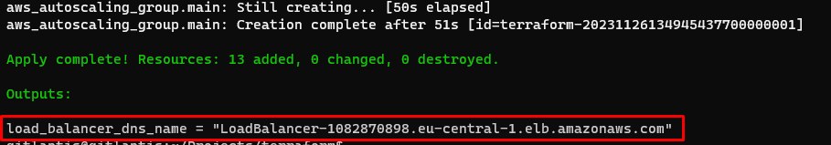

# 1. AWS ClaudFormation

Our concept is creating following architecture:


This is best place for starters. developer can make architecture from graphical interface


however I have created using script. I have three stacks for my nested stack template:
1. ```networking.yml``` - network creating stack template
2. ```security-group.yml``` - security group creats security groups for services 
3. ```instances-and-lb.yml``` - stack for instance and load balancer creating template

all sources are in the ```AWSClaudFormation``` folder


our load balancer template will return balancer dns url:  


and this is our result from load balancer


# 2. Terraform

1. initalize terraform template:

```terraform init```

2. check plans what will be changed:

```terraform plan```

3. apply changes to Amazon cloud:

```terraform apply```

subnet and whole VPC is created


and this is output from terraform script with public dns name:



if we missed up dns name, we can retake output value using this command:

```terraform output load_balancer_dns_name```

autoscaler returning response from first instance


and this is result ater stoping first instance


and last task is destroying all resources:

```terraform destroy```